# PixelForge Engine

Un éditeur de jeux 2D **fait pour le pixel art**, de bout en bout.

Ce n'est pas un moteur généraliste avec un mode pixel art. C'est l'inverse : la
grille de pixels est le contrat de base, et tout le reste s'y plie.

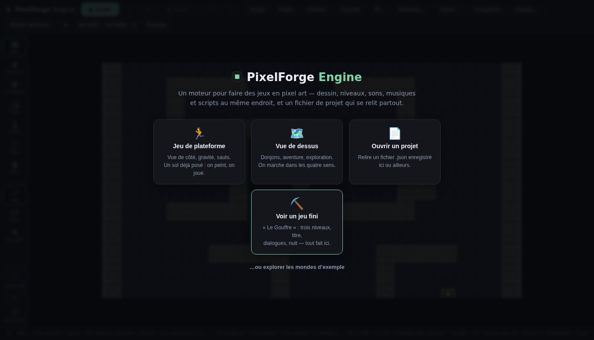

On lance, on choisit — **jeu de plateforme** ou **vue de dessus** — et l'on est
dans son jeu : un sol déjà posé, un héros dessus, les outils dans le dock de
gauche avec leur raccourci, et le bas de l'écran qui explique l'outil courant.
Peindre, poser une gelée, appuyer sur **▶ Jouer** : la première partie se joue
dans la première minute.

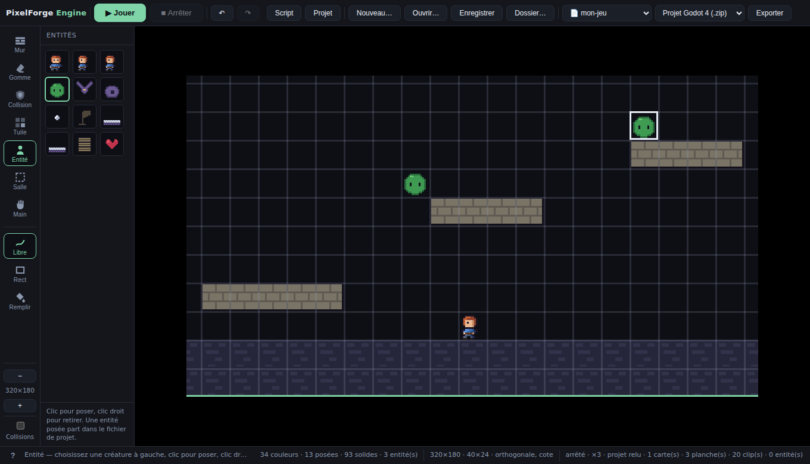

## Quatre mondes d'exemple, un seul moteur

|  |  |
| --- | --- |
| **Donjon** — orthogonale, vue de dessus | **Caverne** — orthogonale, vue de côté |
| 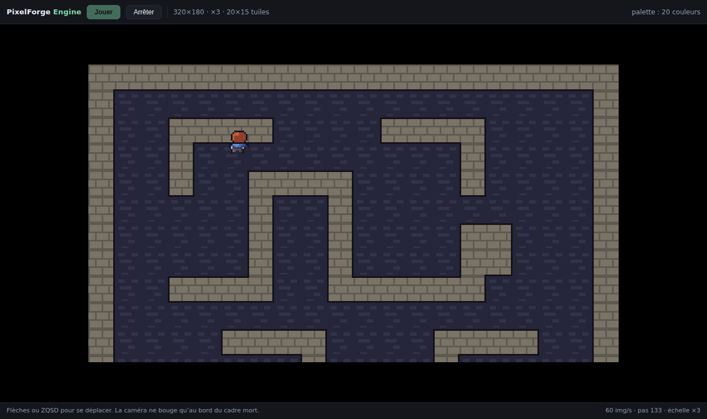 | 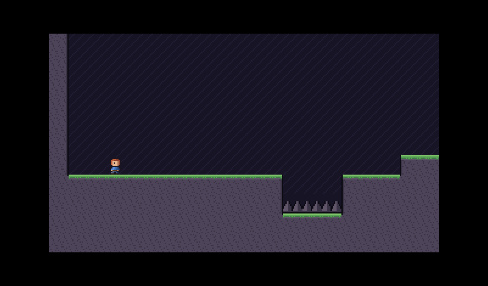 |
| **Étage engendré** — salles, caméra verrouillée | |
| 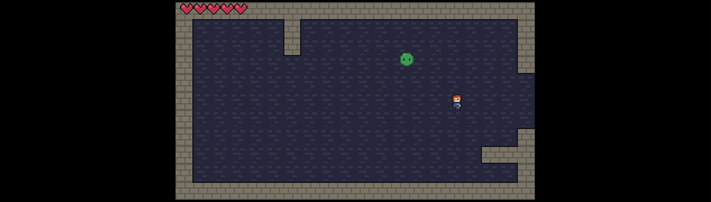 | |

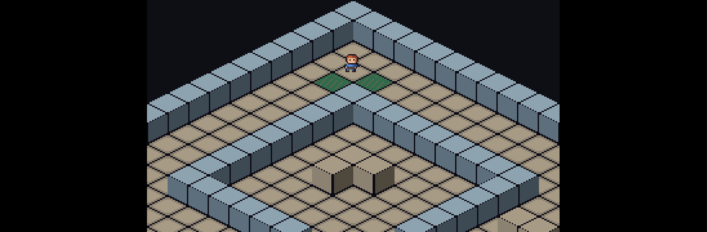

Les quatre se choisissent dans la barre de l'éditeur et se jouent tout de suite.
Ils partagent **tout** ce qui compte : la même grille carrée de seize pixels, le
même moteur de collision, le même héros, le même contrat de pixel. Ce qui les
sépare tient en trois déclarations — une projection, un script, une planche de
dessins.

C'est délibéré. Une carte isométrique n'est pas une autre géométrie : c'est la
même grille carrée, regardée de biais. Faire vivre le gameplay dans le losange
obligerait à réécrire les collisions, la poursuite, la distance — et à les
réécrire une deuxième fois pour l'hexagone. Le monde reste donc carré, et la
projection n'intervient qu'au **dessin** et au **clic**.

Ce que ça achète, mode par mode :

- **Vue de dessus** — la diagonale est normalisée, le tri se fait par `y`.
- **Vue de côté** — le contrôleur de plateforme complet : coyote time, tampon de
  saut, hauteur variable, correction de coin, apex flottant, glissade et saut
  muraux, dash. Le puits du niveau se remonte en sautant d'une paroi à l'autre,
  et le banc le **prouve** en le rejouant avec le vrai contrôleur. Les pointes
  tuent en un coup, on repart à la dernière balise, et les passerelles se
  traversent par en dessous.
- **Isométrique** — les losanges 2:1 pavent le plan sans un pixel de fond
  visible, le clic vise le bon losange jusqu'aux bords, et tuiles et personnages
  sont mêlés dans un seul tri : un mur passe devant ou derrière le héros selon
  sa case, et la réponse change à chaque pas.
- **Salles engendrées** — un étage à la Isaac, tiré d'une graine : le boss au
  cul-de-sac le plus loin du départ, le trésor dans une autre impasse, et la
  caméra verrouillée sur la salle — on ne voit la suivante qu'en y entrant. Des
  créatures, une épée, cinq cœurs, et de quoi mourir.

### L'étage engendré, en détail

La règle qui fait tout tient en une ligne : **une salle candidate est refusée
si elle touche déjà plus d'une salle placée.** Sans elle, les salles se collent
en pavé, il n'y a plus ni branche ni cul-de-sac, donc plus rien à découvrir et
nulle part où mettre un trésor. Le banc le mesure : 5 impasses par étage avec
la règle, 0 pour un pavé.

Les obstacles évitent deux bandes — celle des portes horizontales, celle des
portes verticales — qui forment une croix libre au milieu de chaque salle et
relient à elles seules les quatre portes possibles. Aucun tirage ne peut donc
condamner une salle. L'alternative — poser au hasard, vérifier, recommencer —
est séduisante et mauvaise : elle rend le temps de génération imprévisible, et
elle ne garantit rien tant qu'on n'a pas borné le nombre d'essais. Une règle
qui rend la faute **impossible** vaut mieux qu'une règle qui la rattrape.

Et la vérification qui compte n'est pas sur le plan : elle marche **case par
case sur la vraie grille de tuiles**, depuis le départ, et exige d'atteindre le
centre de chaque salle. 60 étages, 720 salles, aucune injoignable. Un plan peut
être parfait et l'assemblage condamner une porte.

### Une salle se tire à la souris

Une salle se réglait par quatre nombres dans un panneau : `x`, `y`, largeur,
hauteur. C'est exact, et c'est inutilisable — on dessine un niveau à la souris,
en regardant le décor, pas en tapant « largeur : 14 » puis en allant voir.

Avec l'outil **Salle** : tirer un rectangle en crée une, tirer son **intérieur**
la déplace, tirer un de ses **bords ou coins** la retaille. <kbd>Maj</kbd> force
la création — deux salles peuvent se recouvrir, c'est une faute que l'éditeur
*signale* au lieu de l'interdire, et il faut donc pouvoir la commettre.

La question « ce point tombe-t-il sur le bord nord, sur le coin sud-est, ou
dedans ? » est un **calcul**, et il vit dans `niveau/salles.ts` avec le reste
des salles, pas dans l'éditeur : on ne peut pas prouver qu'un coin est
atteignable en regardant un écran. Deux règles y sont écrites une fois pour
toutes : l'épaisseur du bord ne dépasse jamais le tiers de la salle — sinon une
petite salle ne serait faite que de bords et ne se déplacerait plus — et une
salle ne descend jamais sous deux cases de côté, comme à la création.

Le journal ne reçoit qu'à la **fin** du geste, avec les deux rectangles : un
Ctrl+Z défait toute la retaille, au lieu de rejouer trente cases traversées.

### Les salles sont dessinées à la main, le tirage choisit laquelle

Le hasard suffit à prouver qu'un étage tient debout ; il ne fait pas un jeu.
Personne ne se souvient d'une salle tirée au sort. On se souvient de la salle
aux quatre piliers, de celle où deux tourelles se font face à couvert, de celle
qui est presque vide et où l'on comprend qu'il va falloir se retourner. Ces
salles-là sont **écrites** — dix-huit colonnes sur neuf, une lettre par case,
comme les planches de dessins — et le tirage ne choisit que laquelle et dans
quel sens. C'est le partage d'Isaac, de Dead Cells et de Spelunky : le hasard
décide de la forme de l'étage, la main décide du contenu de chaque pièce.

**Un modèle n'a pas à connaître ses portes.** Isaac range ses salles par
configuration de portes — nord, nord et est, et ainsi de suite jusqu'à quinze
familles. C'est beaucoup de dessins pour une propriété qui se garantit
autrement : si la croix centrale reste libre, les quatre portes possibles sont
reliées entre elles quelle que soit la configuration. Sept dessins valent alors
quinze familles — et comme la croix est **centrée**, elle est symétrique sur
les deux axes, donc un modèle valable le reste retourné. Sept dessins, quatre
orientations, vingt-huit salles distinctes à l'œil.

La croix n'est pas une convention polie : elle est **vérifiée**. Un bloc posé
dedans fait refuser le modèle au démarrage, avec sa case — « case 8,4 : un bloc
barre la croix des portes ». Une salle close ne se voit qu'en jouant, une fois
sur douze, et seulement si l'on va jusque-là. Le banc éprouve les deux versants :
les sept dessins livrés passent dans leurs quatre orientations, et trois dessins
volontairement fautifs — un bloc dans la croix, une rangée trop courte, une
lettre qui ne veut rien dire — sont bien refusés. Une règle qui ne refuse jamais
rien est indistinguable d'une règle absente.

Une salle sans modèle retombe sur les amas tirés au sort. Ce n'est pas un
vestige : c'est ce qui permet d'ajouter un dessin et de voir ce qu'il donne, au
lieu d'avoir à couvrir tous les rôles avant que le premier ne serve.

Ce chemin de repli a d'ailleurs révélé un défaut qui dormait là depuis le
début. Les amas évitaient les cases **marquées** en comparant leur tuile à la
tuile marqueur ; quand l'appelant ne précise ni l'une ni l'autre, les deux
valent zéro, toute case passe pour marquée, et plus un seul obstacle n'est posé.
Les salles étaient vides, sans que rien ne le signale — y compris dans le banc,
qui appelait justement sans préciser. L'identité d'une tuile est une mauvaise
façon de dire « cette case est spéciale » : on retient maintenant la case.

### Le combat, et les deux règles qui le tiennent

**Un coup ne touche qu'une fois par cible.** Une frappe dure : le geste occupe
120 ms, soit six images. Si la boîte blessait à chaque image, un coup d'épée
ferait six fois les dégâts, et la difficulté du jeu dépendrait du taux de
rafraîchissement. Le banc oppose les deux versions : 1 impact contre 7.

**Être touché rend invulnérable un instant.** Six dixièmes pour le joueur — de
quoi voir ce qui l'a atteint et sortir du danger. Deux dixièmes pour un ennemi —
de quoi ne pas mourir en une image, sans que l'épée ait l'air molle. Le même
nombre pour les deux donne un jeu où l'un des deux camps se joue mal.

Les deux règles se ressemblent et ne se remplacent pas : la première protège
d'un même coup, la seconde de deux coups différents.

La boîte de l'épée part du **corps** et s'étend vers l'avant. Une première
version la posait, carrée, à dix-huit pixels devant : elle ratait tout ce qui
était collé au personnage — c'est-à-dire exactement ce qui venait de le blesser.
Quatre vérifications gardent ce cas : collée devant, à bout de portée, au-dessus,
en dessous ; et une cinquième exige qu'elle ne touche pas dans le dos.

Une créature au-delà de 340 pixels ne fait rien. Ce n'est pas une optimisation,
c'est une règle de jeu : sans elle, les vingt-deux créatures de l'étage
convergent dès la première seconde et le joueur les affronte toutes dans le
couloir de départ.

## Ce qu'une case FAIT, et pas seulement ce qu'elle montre

La grille de collision ne disait qu'une chose : ça bloque, ou ça ne bloque pas.
Avec ce seul bit on ne peut écrire ni une pointe, ni une plateforme qu'on
traverse par en dessous, ni une échelle, ni de l'eau — c'est-à-dire qu'on ne
peut faire ni Celeste, ni Dead Cells, ni la moitié d'un Isaac.

Une case porte maintenant des **drapeaux** : `Solide`, `Plateforme`,
`Blessante`, `Échelle`, `Liquide`. Des drapeaux et non un type unique, parce
qu'une pointe peut être solide et de l'eau peut blesser : un type obligerait à
inventer « solide-et-blessant », puis « solide-et-blessant-et-liquide ». Ils se
peignent avec l'outil **Collision**, en cases à cocher.

### La plateforme, et la règle qui n'est pas celle qu'on croit

Une plateforme ne bloque **que** si le bas du corps arrive pile sur le haut de
la case. On écrit d'abord « elle bloque ce qui descend », et c'est faux : un
corps déjà engagé dedans, parce qu'il a sauté par en dessous, s'y retrouve pris
à l'instant où il redescend. Il faut le **croisement du bord**, pas la
direction. Le banc garde ce cas précis.

### Mourir, et repartir

Une pointe blesse par une frappe ordinaire, du camp `decor` — qui n'appartient
à personne, et pique donc le héros comme la créature qui marche dessus. Traiter
les pièges comme un second mécanisme aurait demandé de réécrire les images
d'invulnérabilité une deuxième fois.

La mort mène à une **réapparition**, six dixièmes de seconde plus tard, au
dernier point de reprise — et l'on repart invulnérable un instant, sans quoi
renaître dans la pointe qui vient de tuer recommence la mort à l'image suivante.
Le point de reprise se déplace en touchant une **balise**, qui est une entité
comme les autres : une valeur dans sa description la distingue d'un cœur.

## Les entités sont des données

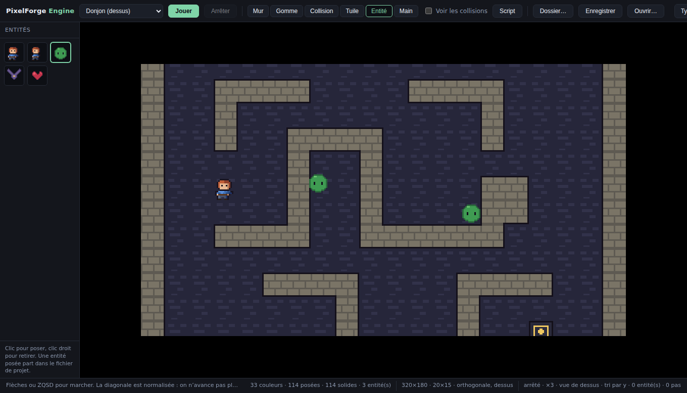

L'outil **Entité** montre les espèces du projet en vignettes ; on clique pour
poser, clic droit pour retirer. L'outil **Tuile** fait de même avec la planche,
pour les cas où l'autotiling ne sait pas deviner.

Poser une créature, c'est **ajouter un nœud à la scène**. Rien d'autre. Le
peuplement s'accorde tout seul au pas suivant — on peut donc éditer pendant que
le jeu tourne. Et comme c'est un nœud, ça part dans le fichier de projet avec
tout le reste.

Une espèce est entièrement en données : sa vie, sa vitesse, ses dégâts, sa
boîte, ce qu'elle rend quand on la ramasse, et son **intention** sous forme de
nom — `immobile`, `patrouille`, `poursuite`, `bond`, `joueur`, `plateformeur`,
`projectile`. Un fichier ne peut pas contenir de fonction ; un nom, si, et il se
porte dans les six langages.

Le **héros en est une**, et ce n'est pas une coquetterie : tant qu'il naissait
d'un appel de fonction, un projet relu n'avait personne à diriger. Maintenant un
étage enregistré se rouvre avec ses vingt-trois entités, elles bougent encore,
et l'on peut y jouer. C'est ce que le banc vérifie, sans navigateur.

### Une machine à états par espèce

Une intention seule ne fait pas un ennemi. « Poursuite » décrit un tas de
gélée ; ça ne décrit pas une tourelle, qui guette, vise, tire, puis souffle.
Une espèce peut donc porter des **états** nommés : chacun a son clip, son
intention, sa durée, l'état qui suit, et deux bascules de distance —
`siProche` et `siLoin`. La tourelle est quatre lignes de données : `guet`
bascule vers `anticipe` en deçà de 90 px, `anticipe` dure 250 ms puis passe à
`tire`, `tire` passe à `repos`, `repos` revient au `guet`.

L'état d'anticipation n'est pas un détail de mise en scène : **c'est lui qui
rend l'ennemi juste**. Un tir sans préavis ne se lit pas, donc ne s'évite pas,
donc le joueur accuse le jeu au lieu de s'accuser lui-même. Un quart de seconde
de posture visible change une mort injuste en erreur reconnue.

### Le coup part de l'image, pas du chronomètre

Un état peut porter des **déclencheurs**, et un déclencheur est attaché à un
**événement d'animation**, jamais à un nombre de millisecondes. « Le coup porte
à la troisième image » ne peut pas s'écrire en millisecondes sans mentir : la
durée change dès qu'on retouche le clip, et le réglage se déphase en silence.
Attaché à l'image, il reste vrai après la retouche. Et comme les événements de
clip survivent à une image de jeu longue, le tir ne se perd pas quand la page
hésite.

Un déclencheur fait une **frappe** — dégâts, portée, épaisseur, durée, poussée —
ou un **tir**, qui lance une autre espèce. Un projectile n'est rien de plus
qu'une entité de plus : sa propre espèce, sa vitesse, sa durée de vie, et il
meurt au premier mur. Il traverse donc les mêmes sauvegardes, le même export,
les mêmes six langages que le reste — au lieu d'être un système à part qu'il
faudrait porter une deuxième fois.

Le clip de tir est en **boucle unique**. Il a d'abord été laissé en boucle, et
la tourelle tirait deux fois par cycle : l'événement repassait avant la fin de
l'état. C'est le genre de bogue qu'un banc attrape et qu'une relecture ne voit
pas.

### Ce qui bouge et qui n'est pas une case

Tout le décor tenait dans la grille de tuiles. C'est exact pour un mur et faux
pour tout ce qui bouge : une plateforme qui monte, une caisse, une porte qui
coulisse. Une case ne sait pas dire « je suis ici, à treize pixels ».

Il existe donc un **registre de corps mobiles**, en pixels, qui se *branche* sur
la grille. Le contrôleur de plateforme, le déplacement des créatures et les
scripts passent tous par la même interface : aucun des trois n'apprend qu'il
existe des corps mobiles, et un obstacle qui se déplace devient du décor du
point de vue de qui se cogne dedans. Les drapeaux sont ceux des cases — solide,
plateforme à sens unique — et ce n'est pas une coïncidence.

Une plateforme mobile est donc **une entité de plus**, décrite en données : son
aller-retour tient en quatre nombres — de combien, en combien de temps, avec
quelle pause aux extrémités. La pause n'est pas décorative : c'est elle qui
donne le temps de monter. Le mouvement est linéaire et non adouci ; une
plateforme adoucie est plus jolie et moins lisible, on ne sait plus quand elle
repart, donc on rate le saut.

Le passager est relevé **avant** que la plateforme ne bouge, jamais après : une
fois qu'elle a bougé, plus rien ne repose dessus, et l'on cherche une liste qui
n'existe plus. Et il est déplacé sans recevoir de vitesse — une vitesse le
ferait continuer tout seul à l'instant où la plateforme s'arrête, ce qui est le
défaut classique du passager éjecté en bout de course.

### Sauter sur la tête, et l'ordre qui rend ça juste

Le piétinement se règle en données lui aussi : la victime dit ce qu'elle perd
et de quelle hauteur on rebondit. La hauteur appartient à la **victime** parce
qu'un ressort vivant renvoie plus haut qu'un champignon, et que c'est ce qui
distingue deux ennemis qui se ressemblent. Une créature à pointes peut refuser
d'être piétinée : sans ce refus, le joueur apprend un geste qui le tue une fois
sur deux.

Ce qui a demandé le plus de soin n'est pas la détection, c'est l'**ordre**. Une
première version résolvait le piétinement au début du pas, donc sur les
positions du pas précédent : le héros mangeait le coup à l'image où il
atterrissait sur la gelée, et ne l'écrasait qu'à la suivante — il payait un
point de vie pour un geste réussi. Maintenant chacun frappe depuis la place où
il est vraiment : on bouge, puis on piétine, puis on blesse au contact. Le banc
mesure les deux versants — la créature meurt quand on lui tombe dessus, elle
survit quand on la frôle ou quand on la traverse en montant — parce qu'une
règle qui ne refuse jamais rien est indistinguable d'une règle absente.

### Défaire, et pourquoi on enregistre la différence

On pourrait enregistrer « pinceau de terrain en 12,7 » et rejouer l'inverse.
C'est plus économe, et c'est un piège : poser du terrain repeint aussi les huit
voisins, met à jour la collision, et un jour fera autre chose encore. Chaque
nouvelle conséquence devrait être ajoutée à l'inverse, et la première oubliée
laisse un « défaire » qui ne défait pas tout — le pire des défauts, parce qu'on
ne s'en aperçoit que trois gestes plus tard.

L'éditeur photographie donc la carte avant le geste, compare après, et garde les
cases qui ont changé. Quelques kilo-octets par coup de pinceau, et la garantie
est totale **par construction** au lieu d'être totale par vigilance.

### Un seul journal, sans exception

L'aide de l'éditeur a longtemps porté cette phrase, et elle était honnête :
« ces gestes-là reconstruisent le projet et **ne se défont pas** au Ctrl+Z ».
Redimensionner une carte, ajouter un calque, créer une espèce, importer un
niveau Tiled, déplacer un nœud dans l'arbre : la moitié de ce qu'on fait dans
un éditeur.

La cause n'était pas un oubli, c'était une architecture. Un geste de structure
**relit** le projet et reconstruit le monde de fond en comble ; l'historique
vivait dans l'objet reconstruit, et naissait donc vide. Et même s'il avait
survécu, ses gestes n'auraient rien défait : ils gardaient une **référence**
au tableau de cases, au nœud posé. Après la reconstruction, ces objets existent
encore en mémoire mais plus personne ne les dessine — défaire y écrivait sans
rien changer à l'écran.

Le journal ne garde donc plus rien de vivant, il garde des **adresses** :

| Geste | Ce que le journal retient |
| --- | --- |
| coup de pinceau | « les cases du calque *décor* de la carte *niveau2* », résolues au moment de défaire |
| entité posée, retirée, déplacée | son identifiant, celui de son parent, et sa description sérialisée |
| salle | sa valeur, jamais sa référence |
| geste de structure | deux photographies du projet entier, sous forme de texte |

Une adresse qui ne mène plus nulle part — le calque a été supprimé depuis —
n'écrit **rien du tout**, plutôt que d'écrire au hasard dans une autre carte.
La description d'une entité est reprise à chaque retrait, pour qu'une créature
déplacée puis retirée revienne là où elle était en partant. Et puisqu'un geste
sait sur quelle carte il a eu lieu, défaire un coup de pinceau donné sur le
niveau deux pendant qu'on regarde le niveau un **ramène le niveau deux sous
les yeux**.

Les photographies ont demandé au journal de compter ce qu'il pèse : cinquante
photographies d'un projet d'un méga-octet feraient tomber l'onglet. Il oublie
les plus vieux gestes au-delà de vingt-quatre méga-octets — mais jamais le
dernier, si énorme soit-il, sinon le geste qu'on vient de faire serait le
premier à disparaître.

Rien de tout cela n'était possible tant qu'un nœud relu recevait un
identifiant **neuf**. Il garde maintenant le sien, et le compteur est poussé
au-delà pour qu'un nœud créé ensuite ne reprenne pas un numéro déjà pris :
l'identité d'un nœud survit à un aller-retour par le fichier.

Le banc de fumée fait le parcours entier dans un vrai navigateur : peindre,
redimensionner, Ctrl+Z, puis **Ctrl+Z encore** — c'est le deuxième qui ne
marchait pas.

### Ce que ce choix coûte, mesuré

Chaque geste de structure transforme le projet sérialisé, le relit, et en prend
deux photographies. C'est cher *en apparence*, et c'est exactement le genre
d'affirmation qui mérite un chiffre plutôt qu'une intuition. Sur un projet de
**392 Ko** — une carte de 120×80, trois calques, deux cents entités posées, soit
cinq fois le départ :

| | |
| --- | --- |
| photographier le projet entier | **1,9 ms** (le journal en prend deux) |
| transformer (le geste lui-même) | **0,1 ms** |
| relire et reconstruire le monde | **5,1 ms** |
| **un geste complet** | **9 ms** |

Neuf millisecondes pour un geste qu'on fait quelques fois par minute, contre une
classe entière de bogues supprimée par construction. Le banc de charge le
mesure à chaque passage : si un jour cela dérive, il le dira.

## Partir de rien

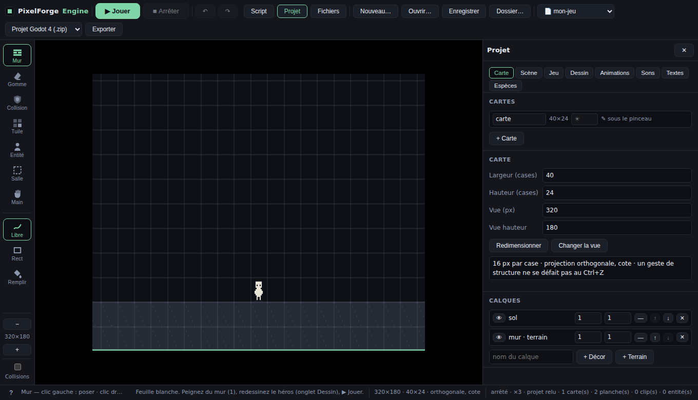

**Nouveau…** — ou l'accueil — donne un projet **né jouable** : une carte au
sol déjà peint, deux calques, un héros posé dessus et le catalogue des
espèces. Il y a **deux départs** : la *feuille blanche* — des tuiles neutres,
un héros neutre, rien de la démo (voir « La liberté » ci-dessous) — et le
départ *avec les assets de la démo*, pour étudier des créatures toutes
faites. En vue de côté, le sol du bas naît solide : un projet plateforme qui
s'ouvrirait sur une chute libre dans le noir ne dirait pas « éditeur », il
dirait « cassé ». Ce qui manque, c'est *votre* décor, et c'est justement ce
qu'on vient
dessiner. Un projet neuf sans héros s'ouvrirait sur un rectangle noir où
« Jouer » ne ferait rien, et la première impression serait « c'est cassé ».

Le panneau **Projet** fait ce que le pinceau ne sait pas faire : redimensionner
la carte, ajouter ou retirer un calque, en changer l'ordre, créer une espèce
sans écrire une ligne de TypeScript.

### Pourquoi tout passe par le fichier de projet

Ces gestes-là touchent à la **structure**. On pourrait les faire en place —
agrandir les tableaux, pousser un calque, ajouter une entrée au catalogue — et
c'est ce qu'on écrit d'abord. Chacun oblige alors à se souvenir de tout ce qui
dépend de la chose changée : la grille de collision, la présence de chaque
calque, l'atlas, la caméra, le peuplement déjà adopté, l'historique qui pointe
sur des index devenus faux. Le premier oubli ne se voit pas, et le deuxième se
voit trois gestes plus tard.

Ici, chaque geste transforme le **projet sérialisé**, et l'éditeur relit le
résultat par le chemin qui sert déjà à rouvrir un fichier. Ce chemin est
éprouvé à chaque banc, il reconstruit tout, et il ne peut rien oublier
puisqu'il ne garde rien. Le prix est une reconstruction de quelques
millisecondes, et le fait qu'un geste de structure **ne se défasse pas** au
Ctrl+Z — ce qu'on dit au lieu de le cacher.

Le gain second n'est pas mince : ces gestes **éprouvent le format**. Un champ
que la relecture perdrait se voit tout de suite, dans l'éditeur, au lieu
d'attendre le jour où quelqu'un rouvre un vieux fichier. C'est comme ça qu'on a
trouvé que la présence d'un calque **sans terrain** n'était pas relue : le
fichier l'écrivait, le lecteur la jetait. Une perte silencieuse — c'est-à-dire
le pire des défauts, et celui que le commentaire d'à côté disait refuser.

Une espèce créée dans le panneau passe par la **même fabrique** que le
catalogue écrit en TypeScript : tout champ qu'on ne remplit pas prend la valeur
par défaut du moteur, et le banc vérifie qu'elle a exactement les mêmes vingt-six
champs que « Gelée ». Sans cela, une espèce de l'éditeur serait une espèce de
deuxième classe, à qui il manquerait le champ qu'on vient d'ajouter au moteur.

### Le cadre d'édition n'est pas un zoom

L'échelle à l'écran est entière, toujours. Un zoom qui la multiplierait par 1,5
casserait ce contrat à la première molette. Les boutons **−** et **+** changent
donc la **résolution virtuelle pendant l'édition** : un cadre deux fois plus
large montre deux fois plus de carte, avec des pixels deux fois plus petits, et
l'échelle reste entière. Le cadre du jeu, lui, ne bouge jamais — il est remis à
celui du monde dès qu'on appuie sur Jouer. Sinon on réglerait la difficulté du
jeu avec un bouton de zoom, en voyant arriver ce que le joueur ne verra pas.

### Ce qu'un vrai navigateur a trouvé et qu'aucun banc ne pouvait dire

Le parcours complet — créer un projet, peindre, poser une créature, la traîner,
redimensionner, ajouter un calque, créer une espèce, jouer — tourne dans un
navigateur à chaque exécution de la fumée. C'est la seule vérification qui
réponde à « quelqu'un d'autre peut-il s'en servir ».

Elle a payé du premier coup. Le panneau gardait le projet **capturé au moment
où il avait été dessiné** : on ouvrait le panneau, on peignait dix cases, on
redimensionnait — et les dix cases disparaissaient, parce que le
redimensionnement s'appliquait à l'état d'avant. Aucun banc ne pouvait le dire :
ils appellent la fonction sur un projet qu'ils viennent de fabriquer, où la
question du « quand » ne se pose pas.

## La liberté : rien n'est précodé

Le retour qui a déclenché ce chantier : *« j'ai l'impression que tout est
précodé et que je n'ai pas de liberté »*. Il était juste. Les comportements
étaient une liste fermée, la physique était celle d'usine, l'épée et les
cœurs étaient imposés, et un projet neuf arrivait avec le donjon et les
gelées de quelqu'un d'autre. Quatre réponses, chacune vérifiée au banc dans
les deux sens — la liberté nouvelle marche, ET les projets d'avant jouent
comme avant.

### L'espèce scriptée

Le comportement d'une espèce n'est plus limité au catalogue (`poursuite`,
`patrouille`, `fuite`…) : le comportement **`script`** donne le pas de
l'espèce à *votre* code, dans le même atelier que les déclencheurs — `c` le
contexte, `n` le nœud. La source vit dans le fichier de projet et traverse
l'export ; ce qui toucherait au DOM est refusé à la compilation, parce que ça
ne passerait pas la frontière d'un export Godot ou Python. Une espèce
scriptée dont le script a une faute reste **immobile** au lieu de casser la
boucle : l'oubli se voit, il ne jette pas.

### La physique à soi

Les réglages du contrôleur plateforme — hauteur et durée du saut, coyote,
dash, glissade de mur, huit boutons dans l'onglet Espèces — se règlent **par
espèce**. Un champ vide laisse l'usine, et le fichier ne porte que ce qu'on a
décidé. Le banc mesure le saut au sommet : 48 px d'usine, 96 px réglé — pas
promis, mesuré.

### Les règles du jeu se débrayent

L'épée, les cœurs à l'écran, le délai de réapparition, les dégâts des pointes :
quatre règles dans l'onglet **Jeu**, plus aucune imposée. Sans épée, la touche
action n'est **pas consommée** — elle reste entière pour vos leviers et vos
dialogues. À zéro dégât, les pointes deviennent du décor. Un fichier d'avant
la version 16 garde l'épée et les cœurs : les défauts sont ceux d'avant.

### La feuille blanche

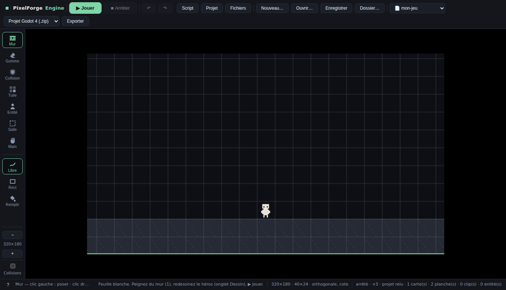

Le départ **vierge** ne transporte *aucun* asset de démonstration : des tuiles
neutres générées depuis les masques de l'autotiling (un aplat, un liseré
d'encre du seul côté sans voisin), un héros en deux couleurs qu'on redessine
en cinq minutes, aucun son, aucun dialogue, aucun clip, pas d'épée. Et il
reste **jouable à la première seconde** — sol pré-peint et solide, héros
posé — parce qu'un départ cassé ne donne pas envie de dessiner. C'est le
départ des cartes d'accueil ; la démo reste à un clic.

Partir de rien n'est pas une impasse : **+ Son** fabrique un son qui s'entend
déjà (une descente de 440 à 220 Hz — chaque réglage du panneau s'entendra),
**+ Animation** un clip de deux images, **+ Planche** une planche neuve d'une
case vide à dessiner sur place. Ces boutons manquaient, et leur absence
fermait des portes que rien ne signalait.

## Les fichiers, comme dans un moteur

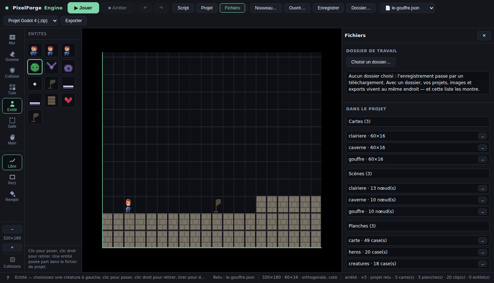

Le retour : *« comparé à Godot, il me manque tout le système de fichiers,
l'importation des assets »*. Et c'était vrai — non parce que ça manquait,
mais parce que c'était **caché** : un bouton « Dossier… » ici, un import au
fond d'un onglet là. Un moteur dont on ne voit pas les fichiers ne donne pas
l'impression d'en avoir.

Le panneau **Fichiers** rend tout visible :

- **Le dossier de travail** — un vrai dossier du disque (File System Access).
  Le panneau liste ce qu'il contient : un `.json` s'**ouvre** comme projet,
  une image s'**importe** en planche, les `.wav` et `.zip` que l'export a
  écrits se voient. Sans dossier choisi, le panneau le dit et explique le
  repli (téléchargement, glisser-déposer).
- **Dans le projet** — l'inventaire du fichier unique : cartes, planches,
  espèces, animations, sons, musiques, dialogues, déclencheurs, chacun avec
  son compte. Cliquer une entrée ouvre **son** éditeur : une carte passe sous
  le pinceau, une planche s'ouvre dans l'atelier de dessin, une espèce dans
  son formulaire. C'est ce qui fait d'une liste un système de fichiers : le
  clic mène quelque part.

Et le **glisser-déposer** : lâchez n'importe quoi sur la page. Une image
devient une planche (avec détection d'échelle et quantification à la
palette), un `.json` s'ouvre comme projet, un `.pixelforge` devient une
planche dont chaque image d'animation est une case, un `.wav` devient un
son. Un voile pendant le survol dit ce que chaque type deviendra — un dépôt
muet obligerait à essayer pour savoir.

### Le son importé (format v17)

La synthèse en six nombres reste le départ — elle se règle, se diffe,
s'exporte — mais un cri enregistré ne se décrit pas en six nombres. Un
`.wav` PCM 16 bits déposé (ou importé du dossier de travail) part **dans**
le fichier de projet en base64 : le projet reste un seul fichier qui se
dépose sur la page. Le son importé se joue tel quel — seul le volume se
règle encore, et le panneau Sons le dit au lieu de montrer des champs sans
effet. Un WAV illisible retombe sur la synthèse : le son change, il ne
disparaît pas — un silence s'oublie, un son étrange se remarque. L'export
vers les moteurs le ré-encode en `.wav` dans l'archive, comme les sons
synthétisés ; l'aller-retour encodeur/décodeur est vérifié au banc à
l'échantillon près.

Un projet PixelForge reste **un seul fichier** — c'est le choix qui permet de
l'ouvrir en le déposant sur la page, et le panneau ne fait pas semblant du
contraire : la colonne « dans le projet » montre le contenu du fichier, pas
des sous-dossiers inventés.

### Les niveaux des autres outils : Tiled et LDtk entrent

`depuisTiled` et `depuisLdtk` existaient et étaient benchés — il manquait le
**dernier mètre**, celui qui les fait entrer dans un projet. Déposez un
`.tmj` (ou un `.json` exporté de Tiled — c'est le **contenu** qui décide,
jamais l'extension) : le niveau devient une carte du projet, avec ses
calques, ses solides tirés du calque d'objets `collision`, et **sa scène
appariée avec le héros dedans** — un niveau importé se joue, il ne se
regarde pas. Un `.ldtk` apporte tous ses niveaux d'un coup, nommés comme
dans LDtk (IntGrid → collision, tuiles → calques). Ce qui n'est pas lu est
dit : carte infinie, tuiles retournées, entités — chaque avertissement
s'affiche au lieu de laisser croire qu'on a tout compris. L'export vers
Tiled et LDtk existait déjà : l'aller-retour est complet.

## L'arbre de scène

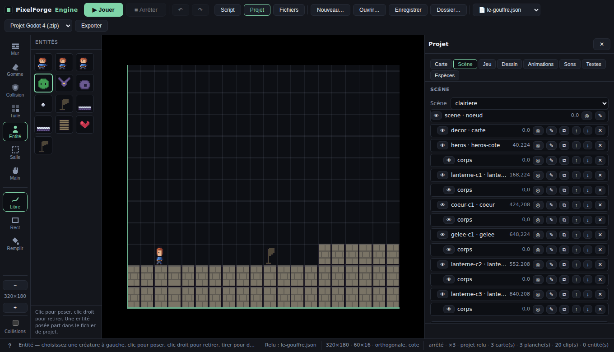

L'outil Entité pose et déplace ; il ne répond pas à « qu'y a-t-il dans cette
scène ? ». Dès qu'un niveau dépasse dix entités, on en perd une derrière un
mur ou sous une autre — et il n'existait aucun moyen de la retrouver, de la
**renommer** (le nom que la caméra et les scripts emploient), ou de la
retirer sans la chercher à la souris.

L'onglet **Scène** du panneau montre l'arbre entier — le décor, le héros et
son corps de collision, chaque créature posée, y compris ce qui est caché :

- **👁** montre ou cache un nœud, lui et les siens ;
- **✎** le renomme ;
- **↑ ↓** le décalent parmi ses frères — l'ordre des frères est l'ordre de
  **dessin**, comme les calques : le dernier passe dessus ;
- **✕** le retire avec tout ce qu'il porte. La racine ne se retire pas —
  une scène sans racine n'est pas vide, elle est invalide — et retirer le
  décor prévient de ce que ça casse.

**☆ Les assemblages** — le prefab. L'étoile de l'arbre enregistre un nœud
et tout ce qu'il porte comme **modèle nommé** ; la palette de l'outil Entité
le propose à côté des espèces, et chaque clic en pose une **copie aux
identifiants neufs** — jamais deux pareils, c'est vérifié au banc — qui se
défait au Ctrl+Z comme toute entité posée. Le modèle est une copie :
retoucher l'original dans la scène ne le change pas, et retirer un modèle
laisse les copies posées. Format v18 ; les scènes portant des copies déjà
instanciées, un moteur du commerce peut ignorer le champ sans rien perdre.

Et l'arbre et la vue **se répondent** : **◎** centre la vue d'édition sur
le nœud — fini de chercher une entité à la souris —, **⧉** la duplique avec
des identifiants neufs, une case à côté ; et saisir une entité dans la vue
la **surligne** dans l'arbre. La vue et l'arbre parlent du même nœud.

### Voir ce qu'on s'apprête à poser

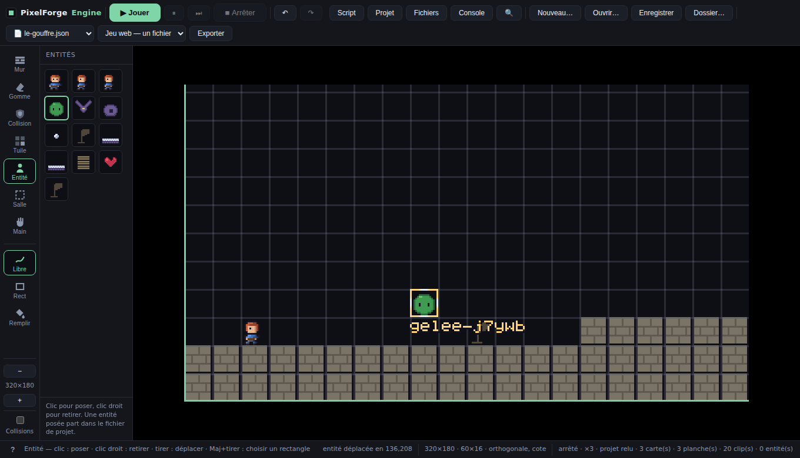

L'outil Entité montrait le contour de la case visée, et rien d'autre : on savait
**où** l'on allait cliquer, jamais **ce qu'on** allait poser. Avec douze espèces
dans la palette, on pose, on regarde, on défait.

Le dessin de la créature s'affiche maintenant sous le curseur, à demi
transparent, **là où elle tombera** — pieds au bas de la case, la convention du
moteur, sinon l'aperçu mentirait d'une demi-case. Un assemblage montre tous ses
nœuds à leur place relative : on voit qu'un lampadaire fait trois cases de haut
avant de le poser.

Et le nœud choisi porte son **nom**, écrit sous son cadre dans la fonte du jeu —
quatre gardiens identiques à l'écran se ressemblent, et savoir lequel
l'inspecteur règle demandait d'aller lire l'arbre.

### L'arbre compose : créer un nœud, changer son parent

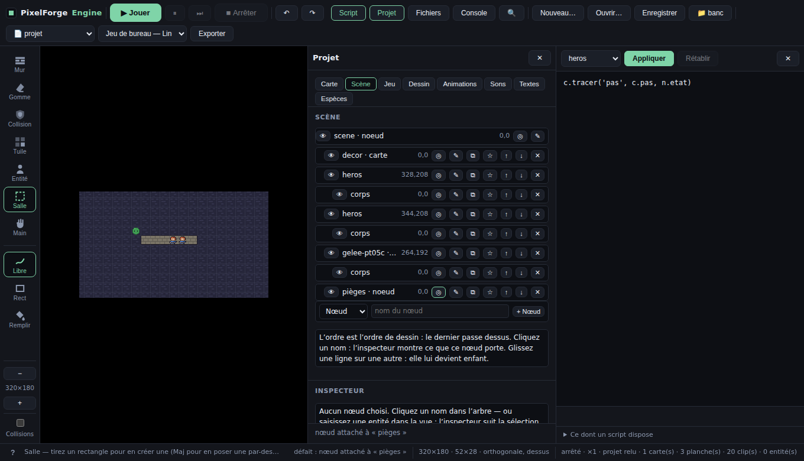

L'arbre **recevait** ce que la palette y posait — des entités — et rien
d'autre. On ne pouvait pas créer un nœud de groupe pour ranger douze pièges,
ni une zone posée à la main, ni une caméra à soi ; et l'on pouvait ordonner des
frères, jamais changer de famille. Un arbre qui ne compose pas n'est pas un
arbre de scène.

**+ Nœud** crée l'un des cinq types du moteur — nœud nu, sprite, corps, zone,
caméra — sous le nœud choisi, ou sous la racine. Le squelette vient du moteur
et non d'une table recopiée dans le panneau : la boîte de huit pixels d'un
corps est décidée à un seul endroit.

**Glisser une ligne sur une autre** la lui donne pour parent, avec tout ce
qu'elle porte. Trois gestes sont refusés, et le refus vit dans le geste et non
dans l'interface : un nœud sur lui-même, un nœud sur l'un de ses propres
descendants — la scène se détacherait d'elle-même et le parcours qui la dessine
tournerait en rond jusqu'à épuiser la pile —, et la racine, qui *est* la scène.
Reposer un nœud chez son parent actuel ne fait rien non plus : sinon le journal
garderait un geste qui ne change rien.

### L'inspecteur : ce qu'un nœud porte

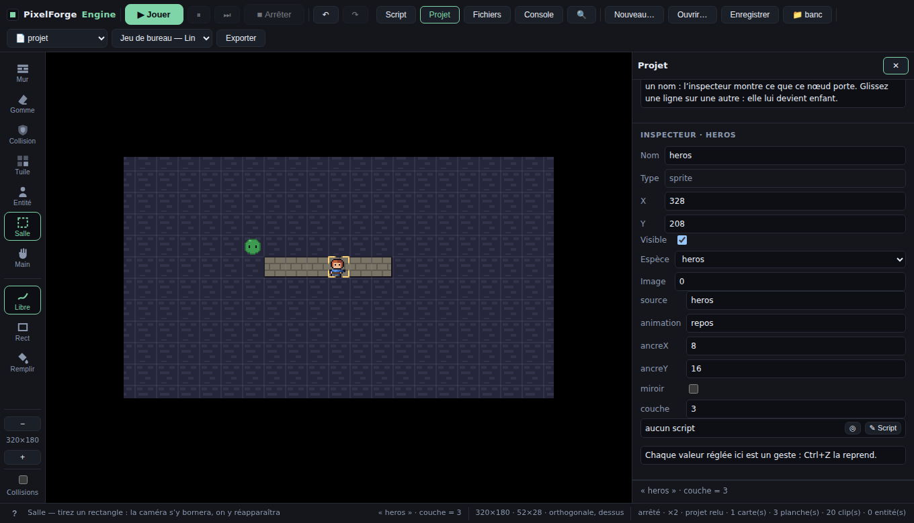

L'arbre disait *qui* est là ; il ne disait pas *ce qu'il porte*. La position
d'une créature, son espèce, la case de planche qu'elle montre, l'ancre de son
dessin, la boîte d'un corps de collision, le rôle d'une zone, les marges d'une
caméra : rien de tout cela ne se lisait nulle part — il fallait ouvrir le
fichier de projet.

Cliquer un **nom** dans l'arbre choisit le nœud : l'inspecteur s'ouvre dessous,
la vue l'entoure de quatre angles jaunes, et saisir une entité dans la vue fait
le chemin inverse. On y règle le nom, le type (en lecture seule : échanger un
corps et une zone laisserait un nœud à moitié dans chaque), X, Y, la visibilité,
l'espèce, l'image — et **tout le reste**.

Ce « reste » est ce qui compte : l'inspecteur **ne connaît aucun type de nœud**.
Il lit le sac de propriétés et déduit le champ de la **valeur** — un nombre
donne un champ numérique, un oui/non une case à cocher, un texte un champ de
texte. Écrire un formulaire par type serait cinq formulaires aujourd'hui, et le
prochain type ajouté au moteur naîtrait sans le sien : un nœud qu'on voit dans
l'arbre et qu'on ne peut pas régler. Ce qui n'est ni nombre, ni texte, ni
oui/non se montre sans se régler, plutôt que de se laisser détruire par un
champ qui ne saurait pas le relire.

**✎ Script** ouvre l'atelier *sur ce nœud-là*, au lieu de le faire chercher
dans une liste de quinze noms. Et chaque valeur réglée ici est un geste de
structure comme un autre : **Ctrl+Z la reprend**.

### Plusieurs nœuds à la fois

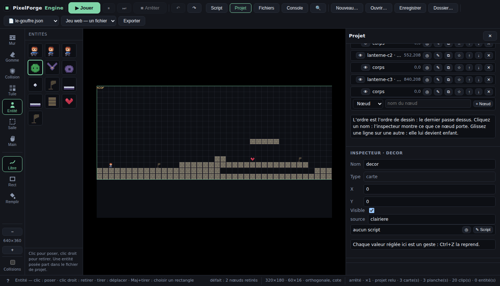

Déplacer six plateformes de deux cases, retirer une rangée de pointes,
dupliquer un groupe de trois lanternes : des gestes ordinaires de level design
qu'il fallait faire **un par un**, en espérant ne pas se tromper d'une case
entre deux.

<kbd>Maj</kbd>+glisser dans la vue avec l'outil Entité tire un rectangle qui
choisit tout ce qu'il couvre ; <kbd>Ctrl</kbd>+clic sur un nom de l'arbre
ajoute ou retire ce nœud de la sélection. Les flèches, <kbd>Suppr</kbd>,
<kbd>Ctrl</kbd>+<kbd>D</kbd>, <kbd>Ctrl</kbd>+<kbd>C</kbd> agissent alors sur
**tous** — et en **un seul geste du journal** : un Ctrl+Z remet les six, au lieu
d'en demander six.

Le **dernier** choisi est le principal : c'est lui que l'inspecteur règle, et la
vue l'entoure plus vivement que les autres. C'est la convention de tous les
éditeurs — le dernier clic décide de ce qu'on regarde.

Deux fautes trouvées au banc, toutes deux invisibles à la lecture :

- le rectangle interrogeait le **peuplement**, la liste des entités que le jeu
  a adoptées — vide tant qu'on n'a pas joué. Un rectangle tiré sur une carte
  fraîchement ouverte ne choisissait donc rien du tout. Il parcourt maintenant
  la scène ;
- la duplication trouvait « les copies » en comparant les deux arbres
  **vivants** — et la scène vivante porte des nœuds éphémères, comme la
  taillade de l'épée, que la sérialisation laisse dehors. L'éditeur
  sélectionnait fièrement une taillade à la place de la copie. La comparaison
  se fait sur le projet sérialisé.

### Copier-coller, d'une scène à l'autre

<kbd>Ctrl</kbd>+<kbd>C</kbd>, <kbd>Ctrl</kbd>+<kbd>X</kbd>,
<kbd>Ctrl</kbd>+<kbd>V</kbd> : le geste que tout le monde tente à la troisième
minute. Il copie le nœud **et tout ce qu'il porte**, et il traverse les
scènes — copiez un lampadaire dans la clairière, mettez la caverne sous le
pinceau, collez.

Le presse-papiers n'est pas celui du système. Celui du navigateur ne rend son
contenu qu'après une permission et un geste, et ce qu'on y met est du texte :
on y écrirait du JSON, qu'un collage dans un traitement de texte transformerait
en pâte illisible. Celui-ci vit dans l'onglet et garde une *description* de
nœud.

Le collage va **sous** le nœud choisi s'il est structurel — un nœud nu, un
groupe : on l'a justement créé pour y ranger des choses — et **à côté** s'il
porte une espèce : coller une créature sous elle-même ferait un empilement que
personne ne demande. Ce que la chose *est* décide, pas un réglage.

Les identifiants sont refaits à chaque collage, y compris quand on colle deux
fois de suite ou dans la scène d'où l'on vient : deux nœuds du même identifiant
rendent « lequel ? » sans réponse — le journal ne saurait plus lequel défaire,
l'arbre en surlignerait deux.

### Renommer suit les références

Le format ne connaît pas de renvois : une espèce est nommée `gelee` dans le
catalogue, et chaque entité posée porte la **chaîne** `gelee`. C'est ce qui rend
le fichier lisible par six langages sans table d'indirection — et ce qui fait
qu'un renommage naïf casse tout ce qui renvoyait à l'ancien nom, sans une
erreur et sans un mot : les créatures posées disparaissent, simplement.

L'identifiant d'une espèce était donc **en lecture seule**. On ne renommait pas,
parce que renommer aurait été faux.

Le geste existe maintenant, et il suit :

| Renommer | Ce qui suit |
| --- | --- |
| une **espèce** | le catalogue, les entités posées de toutes les scènes, les nœuds des assemblages |
| une **planche** | les espèces qui y piochent leurs dessins, les sprites qui la nomment |
| une **carte** | sa scène, le nœud de décor, le déroulé, **ses salles et ses déclencheurs** |

Ces deux derniers manquaient : une carte renommée perdait ses tableaux et ses
déclenchements en silence — la perte qui ne se découvre qu'en jouant. Et le
renommage d'une carte touchait la propriété `source` de **tous** les nœuds,
alors qu'elle veut dire deux choses : le nom d'une carte sur un nœud de décor,
le nom d'une planche sur un sprite. Une planche appelée comme une carte
changeait de nom avec elle.

Ce qu'il ne sait pas suivre, il le **dit**. Un script qui écrit
`c.poser('gelee', x, y)` nomme l'espèce dans du *texte* ; réécrire ce texte
demanderait de comprendre le programme. Le renommage signale donc « 3 script(s)
nomment encore *gelee* », avec la liste. Un renommage qui se tait sur ce qu'il
n'a pas su suivre est un renommage qui ment.

### Le clavier, sur le nœud choisi

Un éditeur de scène se juge à ce qu'on peut faire **sans quitter la vue**.
Déplacer une entité d'un pixel demandait de la saisir à la souris — donc de
viser ; la retirer, un clic droit bien placé ; la dupliquer, un bouton à
trouver dans l'arbre. Une fois un nœud choisi :

| | |
| --- | --- |
| **← → ↑ ↓** | le déplacent d'une case — **Maj** : d'un pixel |
| **Suppr** | le retire, sans demander : ça se défait |
| **Ctrl+D** | le duplique, et **choisit la copie** — on vient de la faire naître |
| **F** | centre la vue dessus |
| **Échap** | le désélectionne ; les flèches déplacent alors la vue |

Les pressions de flèche **fusionnent** : trente pressions sont un seul
déplacement, et **un** Ctrl+Z les rend toutes. Poser un geste par pression
remplirait le journal de trente lignes et demanderait trente Ctrl+Z pour
revenir — ce qui revient à ne pas pouvoir revenir.

Et le choix est un **identifiant**, pas un objet : retirer un nœud puis le
remettre au Ctrl+Z le remet **choisi**, parce qu'il revient avec le même
identifiant. C'est la même propriété qui fait tenir le journal.

Tout passe par les mêmes gestes de structure que le reste : transformer le
projet sérialisé, relire. Le banc vérifie qu'un nœud renommé garde son
identifiant, ses enfants et son espèce, qu'une scène sans héros se relit
sans casser, que deux duplications ne fabriquent jamais le même
identifiant, et la fumée fait le tour complet dans le navigateur sur le
Gouffre entier — renommer une gelée, la cacher, la retirer, viser une
lanterne, la dupliquer.

## Figer une image, et l'avancer d'un pas

Un saut qui accroche, une boîte qui passe au travers, une créature qui traverse
un mur : cela se produit sur **une** image, à soixante par seconde. On ne le
voit pas — on le devine, et l'on modifie au hasard.

**⏸** fige la partie sans la perdre ; **⏭** l'avance d'un seul pas de
simulation. Ce n'est pas « Arrêter » : arrêter rend la main à l'éditeur, qui
repose tout le monde à son départ — on perd l'instant qu'on voulait justement
regarder.

Deux détails font la différence entre un bouton pause et un outil :

- Les surcouches de l'éditeur **reviennent** par-dessus l'instant figé. Cochez
  *Collisions* et vous voyez ce que le décor *fait*, là où le héros vient de
  passer au travers. C'est la réunion des deux moitiés : l'état vivant du jeu,
  et ce que l'éditeur sait en dire.
- Reprendre **jette le temps accumulé**. Il vaudrait le temps passé en pause, et
  la simulation rattraperait d'un coup les cinq pas du plafond : un bond à la
  reprise, exactement ce qu'on ne veut pas après avoir regardé une image de
  près.

Une partie figée **tourne toujours**, au sens de l'éditeur : on ne peut pas y
peindre — sinon la reprise raccrocherait une carte modifiée à un état d'avant.

## Trouver : un seul champ pour tout ce que le projet nomme

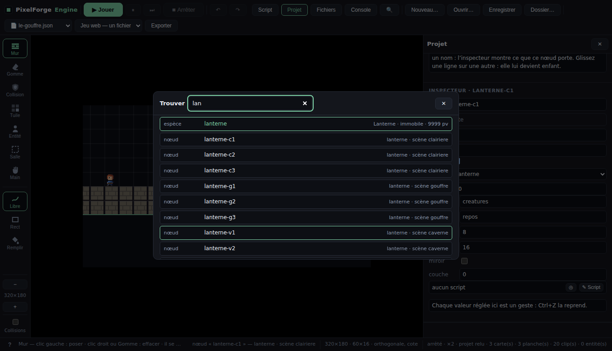

<kbd>Ctrl</kbd>+<kbd>F</kbd>. Un projet est un ensemble de choses **nommées** —
des nœuds dans plusieurs scènes, des cartes, des espèces, des planches, des
sons, des musiques, des dialogues, des animations, des déclencheurs, des salles,
des assemblages. La recherche porte sur toutes, d'un seul champ.

Ce n'est pas un filtre dans l'arbre. Un filtre aurait répondu à « où est le
gardien de la crypte ? » à condition d'avoir d'abord ouvert le panneau Projet,
choisi l'onglet Scène, puis la bonne scène — c'est-à-dire à condition de savoir
déjà où il est.

Chaque résultat sait **où il habite**, et le choisir fait le trajet entier : la
bonne carte sous le pinceau, la vue centrée sur le nœud, le bon onglet ouvert,
le nœud sélectionné dans l'arbre et montré par l'inspecteur.

Deux détails font la différence entre une recherche et une liste :

- **Le classement.** Le nom exact d'abord, puis ce qui commence par ce qu'on
  tape, puis ce qui le contient — et à pertinence égale, un ordre stable. Sans
  cela, <kbd>Entrée</kbd> ne veut rien dire.
- **Les accents.** Chercher `gelee` trouve `Gelée`. Sans cela, la recherche
  punit l'écriture correcte — celle qu'on emploie justement pour nommer les
  choses d'un jeu français.

La position rendue pour un nœud est **absolue** : un nœud enfant porte une
position relative à son parent, et viser celle-là ferait regarder le coin de la
carte.

## Le brouillon : le filet, pas le plancher

Un onglet qui se ferme, une page qui se recharge, une machine qui s'éteint ne
doivent pas coûter l'heure qu'on vient de passer. L'éditeur garde donc un état
du projet toutes les **45 secondes** — et seulement quand on a fait quelque
chose : le journal compte les gestes, et sans geste il n'y a rien à sauver.

Il en garde **trois**, le plus vieux part, et il ne les rouvre **jamais** tout
seul : l'accueil propose une carte *Reprendre — « mon-jeu », il y a 3 min*, et
l'on décide. Le panneau **Fichiers** les montre pendant la séance, avec leur
taille et leur heure, et un bouton pour tout oublier.

Ce n'est **pas** un enregistrement, et l'éditeur le dit à chaque fois qu'il en
parle. Un enregistrement va dans un fichier, dans un dossier à soi, et survit à
tout — un autre navigateur, une autre machine, une sauvegarde de disque. Un
brouillon vit dans la base locale de *ce* navigateur : vider les données du site
l'emporte. Le présenter comme une sauvegarde ferait qu'on cesserait
d'enregistrer, et le jour où quelqu'un vide son cache, le projet de trois
semaines part avec.

## La console : ce que l'éditeur savait et ne disait pas

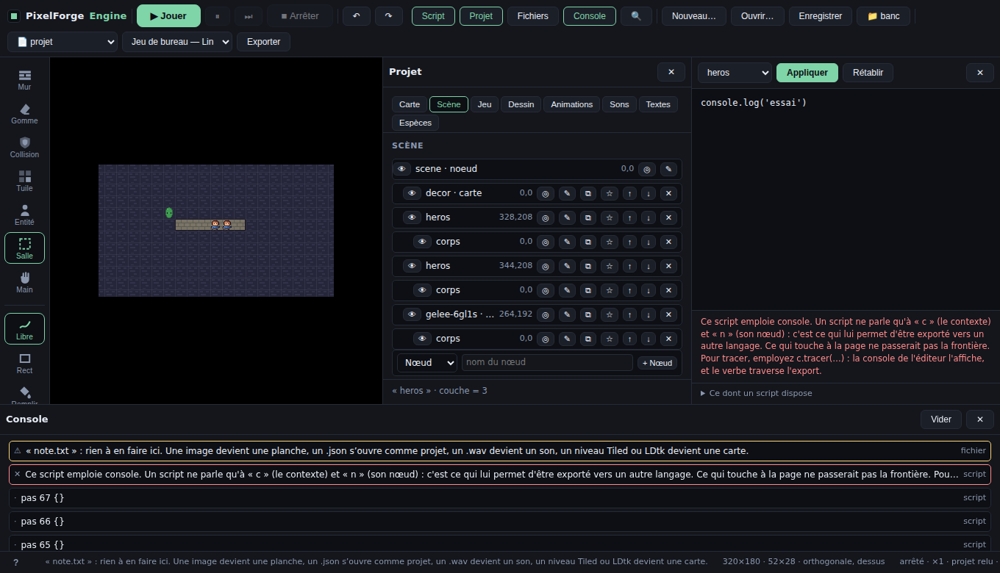

Un projet dont trois scripts sont refusés affichait « 3 script(s) refusé(s) »
dans un coin de la barre d'état. Pas lesquels, pas pourquoi. Une exception
levée pendant que le jeu tourne s'écrivait dans le bandeau de l'atelier —
visible seulement s'il était ouvert, et sur le nœud qu'on y avait choisi. Une
erreur du moteur lui-même partait dans la console du navigateur, que personne
n'ouvre. Et tout le reste — un import refusé, deux salles qui se recouvrent, un
fichier qu'on ne sait pas lire — passait par la barre d'état, qui ne garde
qu'un message à la fois : le suivant efface le précédent, et on n'a jamais le
temps de lire.

La console est **en bas, sur toute la largeur** — sa place dans les moteurs, et
elle ne dispute pas la colonne de droite aux panneaux qu'on lit en même temps
qu'elle. Elle reçoit :

- les **scripts refusés**, un par un, avec la raison ;
- les **exceptions** levées pendant que le jeu tourne, avec le nom du nœud ;
- les **erreurs du moteur** lui-même, et les promesses rejetées ;
- les fichiers **qu'on n'a pas su lire**, les salles qui se recouvrent ;
- ce qu'un script écrit avec **`c.tracer(…)`**.

Un message identique **se compte** au lieu de s'empiler : un script qui échoue
échoue soixante fois par seconde, et soixante lignes par seconde rendent la
console illisible en trois secondes — en poussant hors de l'écran la seule
ligne qui explique. Le bouton porte le nombre de fautes **non lues**, parce
qu'une console fermée qui se remplit d'erreurs sans rien dire ne vaut pas mieux
que pas de console.

### `c.tracer`, et pourquoi `console.log` est refusé

Un script se débogue en regardant ce qu'il croit. Il n'y avait aucun moyen de
le faire : `n.etat.saut` se devinait. `c.tracer(x, n.etat)` écrit une ligne
dans la console, et — comme tous les verbes du contexte — il **traverse
l'export** : dans le jeu livré personne n'écoute et il ne coûte rien, un
portage vers un autre langage peut l'envoyer dans *sa* console.

Du même coup, `console` est entré dans la liste des mots qu'un script n'a pas
le droit de nommer. L'interdire sans rien offrir aurait été refuser sans
alternative — la meilleure façon de faire cesser de croire la règle. Le refus
**dit par quoi le remplacer**.

## Le scripting, dans l'éditeur

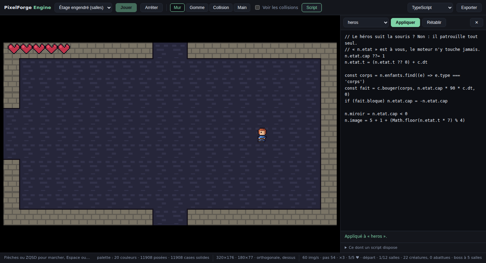

On choisit un nœud, on écrit son comportement, **Ctrl+Entrée**, et ça tourne —
pendant que le jeu joue. Le nœud garde la **source**, pas la fonction compilée :
c'est elle qui part dans le fichier de projet, qui se relit, qui figure dans un
diff.

Un script ne parle qu'à deux choses : `c`, le contexte de jeu, et `n`, son nœud.
Écrire `document`, `fetch`, `localStorage` est **refusé**, avec la raison. Ce
n'est pas un bac à sable de sécurité — le code vient de vous, il tourne chez
vous, et `new Function` n'isole rien. C'est une contrainte de **conception** :
le projet promet de tourner ailleurs, en Python, en Rust, dans Godot, et cette
promesse ne tient que si les scripts ne parlent qu'à `c` et `n`. La règle refuse
ce qui ne passerait pas la frontière, et elle le dit tout de suite au lieu de
laisser découvrir le problème le jour de l'export.

Elle refuse aussi `while (true)` : on ne peut pas interrompre du JavaScript en
cours, et appliquer un script dont on **sait** qu'il fige l'onglet reviendrait à
fermer la porte derrière la personne. Un script est appelé une fois par pas —
c'est le moteur qui boucle.

Et la règle vérifie son propre revers : le mot « document » dans un commentaire
ou dans une chaîne ne fait rien refuser. Refuser à tort est pire que ne rien
vérifier, parce qu'on cesse alors de croire la règle.

Une erreur d'exécution ne fait pas tomber la boucle. Elle est rapportée, et
après cinq le script se met en sommeil : répéter la même exception soixante fois
par seconde n'apprend rien et rend la page inutilisable.

### Un script peut tout ce qu'un jeu fait

Longtemps, `c` savait bouger des corps et lire les entrées — et rien d'autre.
Un script ne pouvait ni jouer un son, ni lancer une musique, ni ouvrir un
dialogue : tout cela existait dans le moteur, mais hors de portée de la
personne qui écrit. Le contexte porte maintenant les verbes du jeu entier, et
chacun correspond à un **nom dans le fichier de projet** — c'est ce qui les
garde exportables :

```js
c.jouer('coup')         // un son du projet — dédoublonné par pas, comme tout son
c.musique('boss')       // la même musique deux fois ne relance rien
c.dire('accueil')       // ouvre une suite de répliques ; le monde s'arrête pour lire
c.secouer(3, 200)       // la secousse de caméra
c.geler(50)             // le hit-stop
c.salle                 // le nom du tableau où l'on est
c.poser('slime', x, y)  // une entité du catalogue, vivante au pas suivant
c.retirer(noeud)        // l'enlève de la scène, où qu'il soit
```

Un monde sans musique peut exécuter un script qui en demande une : le verbe
rend `false`, et rien ne tombe. C'est le script qui apprend qu'il n'y a pas de
musique, pas la boucle qui meurt.

### Les déclencheurs : « quand ceci arrive, joue ce script »

« À l'entrée de ce tableau, lance la musique du boss. » « Au contact de cette
zone, ouvre le dialogue. » C'est de la conception de niveau, pas de la
programmation — et ça vivait pourtant dans le code, donc hors du fichier, donc
hors des portages. Les déclencheurs sont des **données** (format v11) : un nom,
un « quand » (l'entrée d'un tableau, ou le franchissement d'un rectangle de
cases), le nœud qui doit entrer, et la source d'un script — le même `c`, le
même `n` que l'atelier, où `n` est le nœud qui est entré.

Trois règles, toutes éprouvées dans les deux sens :

- **On tire au franchissement**, jamais « tant qu'on y est » : un script rejoué
  soixante fois par seconde rouvrirait le même dialogue en boucle. Ressortir
  puis revenir tire à nouveau — sauf si le déclencheur est marqué « une fois ».
- **Le bord gauche est inclus, le bord droit exclu** : une zone de deux cases
  en couvre exactement deux. Un déclencheur qui tire une case trop tôt ouvre le
  dialogue à travers un mur.
- **« Déjà tiré » est de l'état.** Deux machines en réseau qui n'ont pas le
  même divergent au premier déclencheur — l'une entend la musique du boss,
  l'autre pas. `instantane`/`restaurer`, comme pour les salles : rembobiner
  avant le tir le fait retirer au rejeu, rembobiner après ne le rejoue pas.

Ils s'éditent dans le panneau Projet — le script y est compilé **en tapant**,
et la faute s'affiche sur la ligne : un déclencheur ne se voit pas dans la
scène, un refus silencieux ne tirerait jamais et l'on chercherait la faute
dans le niveau. Les six chargeurs les relisent, et Python comme TypeScript
répondent la même chose à « quels déclencheurs contiennent ce point ».

Et ils ne s'observent **jamais pendant qu'une interface suspend le monde** —
écran-titre, boîte de dialogue. Sans cette règle, un héros qui commence la
partie sur une zone tirerait à travers l'écran-titre, et le niveau changerait
avant qu'on ait appuyé sur quoi que ce soit. C'est un vrai navigateur qui l'a
trouvée, pas un banc : le déclencheur tirait au pas un, pendant que le titre
attendait la barre d'espace.

### Plusieurs cartes, un déroulé : un projet devient un jeu

Le format savait porter plusieurs cartes depuis le premier jour. L'éditeur
n'en montrait qu'une — et surtout, **l'enregistrement ne gardait qu'elle** :
un projet de trois niveaux enregistré puis relu en perdait deux, en silence.
C'est la faute que la version 12 ferme, et la règle qui la ferme est simple :
le monde vivant porte *toutes* ses cartes et *toutes* ses scènes, la paire
active est la même référence que dans la liste, et la sérialisation emporte
la liste.

Chaque carte s'apparie à la **scène du même nom** — c'est ce qui donne à
chaque niveau ses propres créatures, son propre peuplement, son propre
combat. « + Carte » crée le niveau deux avec sa scène et une copie jouable du
héros ; « Éditer » le met sous le pinceau sans rien perdre ; renommer une
carte renomme sa scène, son décor et sa place dans le déroulé, parce que
renommer sans tout suivre casserait le niveau en silence.

Le **déroulé** est la donnée qui fait d'une liste de cartes un jeu : un titre
et un ordre. Un titre ouvre le jeu sur un écran-titre — en pixels du jeu,
comme tout le reste — et Espace le passe. L'ordre par défaut est celui des
cartes ; un ordre explicite l'emporte. Deux verbes le parcourent :

```js
c.aller('grotte')   // change de carte, de scène et de créatures, d'un geste
c.niveauSuivant()   // la carte suivante du déroulé — false au bout
```

La sortie d'un niveau, c'est donc un déclencheur posé sur une zone dont le
script tient en une ligne : `c.niveauSuivant()`. La fumée le prouve de bout
en bout — un jeu à deux niveaux, écran-titre compris, construit par les seuls
boutons de l'éditeur. Et « Rejouer » recommence le **jeu** : retour au niveau
un et au titre, pas au niveau où l'on s'était arrêté.

### La lumière, fidèle à la palette

Assombrir en multipliant les canaux — ce que fait tout moteur généraliste —
fabrique des couleurs qui ne sont dans la palette de personne : un damier de
trois teintes devient un dégradé de milliers, et le jeu cesse d'être du pixel
art à la première torche. Ici, chaque pixel éclairé est **remplacé par une
couleur de la palette du projet** : celle qui ressemble le plus à sa version
assombrie. La nuit d'un projet est faite des couleurs que son artiste a
choisies — et si la palette n'a pas de tons sombres, la nuit le dit en restant
claire, au lieu d'inventer des tons à sa place.

La lumière est quantifiée en quelques niveaux, et la frontière entre deux
niveaux est tramée en damier 2×2 ordonné — déterministe : deux machines qui
rendent la même scène rendent les mêmes pixels. Le réglage tient en deux
données du fichier (v13) : l'**ambiante** du projet, et le rayon de **lueur**
des espèces — une torche est une entité dont la description porte un rayon,
comme une balise porte « reprise ». Les sources se recensent dans la scène
courante : une torche du niveau un n'éclaire pas le niveau deux, et une torche
ramassée s'éteint sans qu'on ait rien à débrancher.

Le prix est **mesuré, pas promis** : la passe complète — 320×180, trois
sources, ambiante 0,25 — coûte environ un cinquième de milliseconde par image
sur la machine du banc de charge, dans le tiers de budget qu'on s'accorde. Et
le plein jour ne paie *rien* : quand l'ambiante vaut un, on ne touche pas aux
pixels. La nuit se joue, l'éditeur à l'arrêt reste en plein jour — on ne peint
pas dans le noir.

La mesure de la nuit dans le navigateur a trouvé un bogue qui n'avait rien à
voir avec elle : la sérialisation prenait la vue de l'*écran* — cadre
d'édition compris — au lieu de celle du monde, et chaque geste du panneau fait
en zoom arrière gonflait la vue du projet de cinquante pour cent. Dix-sept
gestes plus tard, le projet demandait un tampon de trois cent mille pixels de
large. Une vérification garde maintenant ce bogue fermé.

## Le jeu-témoin : « Le Gouffre »

Un moteur se juge sur les jeux qu'on en tire, pas sur ses bancs. Le dépôt
contient donc un jeu complet — trois niveaux, un écran-titre, des dialogues,
une musique, la nuit et ses lanternes, une fin — écrit **sans une ligne de
code moteur** : tout passe par les mêmes fonctions pures que les boutons de
l'éditeur, et le résultat est `public/exemples/le-gouffre.json`, un fichier
de projet ordinaire que « Ouvrir… » relit. `npm run exemple` le refabrique ;
le banc vérifie que l'artefact et son générateur disent exactement la même
chose.

Le banc exige surtout que le jeu **se joue** : chaque niveau est traversé au
vrai contrôleur — tenir droite, sauter dès qu'on peut ; un passage qui
demande un enchaînement précis ne passe pas — et chaque créature posée a les
pieds sur du sol. La fumée fait le reste dans un vrai navigateur : ouvrir le
fichier, passer le titre, lire le dialogue, jouer la clairière au clavier
jusqu'à la caverne, et vérifier que la musique est partie d'un déclencheur.

### Ce que le jeu-témoin a trouvé — le carnet

C'est la raison d'être d'un témoin : chaque manque rencontré en l'écrivant
est devenu soit une correction, soit une ligne de ce carnet.

**Corrigé sur-le-champ :**

- **La carte d'un déclencheur** (format v14). Une zone est en cases, et deux
  cartes ont les mêmes cases : la sortie de la clairière tirait aussi dans la
  caverne. Un déclencheur nomme maintenant sa carte ; vide, il vaut partout.
- **La mort d'un projet relu a maintenant une reprise.** Le héros mourait et
  disparaissait — pas de réapparition, pas de cœurs, une partie ouverte sur
  du vide. La même aventure que les mondes de démonstration sert désormais
  les projets relus : mort et réapparition au point de reprise, balises,
  cœurs qui s'affichent et se ramassent, épée, chute hors du monde fatale.
  La fumée le prouve sur les pointes de la caverne : une mort, retour à
  l'entrée, toute sa vie.
- **Frapper mangeait le saut.** La consommation d'un appui supprimait la
  *touche* — et la barre d'espace sert à « action » et à « saut », par
  conception. L'épée de l'aventure consommait donc le saut : le héros
  marchait contre une marche d'une case sans jamais décoller. La consommation
  est maintenant **par action**, comme le chemin réseau le faisait déjà — les
  deux chemins divergeaient, et la même partie ne se rejouait pas pareil
  selon qu'elle était locale ou imposée. Corollaire : une interface qui
  accepte plusieurs actions les consomme *toutes*, sans court-circuit.
- **Un verbe termine le jeu.** `c.fin()` — l'écran de fin, avec le compte des
  morts et des trouvailles, puis un appui qui ramène au titre, le jeu entier
  remis à son départ. Il se *demande* : si un dernier dialogue est ouvert, la
  fin attend qu'il soit lu — l'écran de fin qui avale les derniers mots du
  jeu serait un beau gâchis. Le Gouffre s'en sert : sa sortie tient en quatre
  lignes de déclencheur, musique de victoire comprise.
- **Le nœud éphémère.** L'effet de taillade que l'aventure pose dans la scène
  partait dans le fichier à chaque sauvegarde — et la relecture en posait un
  de plus par-dessus. Ce qui appartient à l'exécution porte maintenant un
  drapeau `ephemere`, et la sérialisation le saute.

- **La carte partout où des cases sont nommées** (format v15). Les salles
  gagnent leur carte comme les déclencheurs avaient gagné la leur — le
  découpage du niveau un s'appliquait au niveau deux, aux mêmes cases ; deux
  salles aux mêmes cases sur deux cartes ne se gênent plus, et l'outil
  « Salle » pose sur la carte sous le pinceau. Et chaque carte peut porter sa
  propre **ambiante** — la nuit du Gouffre s'épaissit en descendant : 0,8 en
  clairière, 0,5 dans la caverne, 0,3 au fond, mesuré en jouant.

- **Les dialogues et les musiques s'éditent au panneau.** Un onglet
  « Textes » écrit les répliques ; les musiques se règlent sous les sons —
  nom, tempo, boucle, et les notes en texte : `do4 - mi4 - sol4` se lit, se
  copie et se transpose à l'œil, là où un piano dessiné serait dix fois plus
  de code pour écrire les mêmes huit notes. Chaque musique s'écoute d'un
  bouton, entière, parce que c'est en écoutant qu'on écrit la suite.

**Le carnet est soldé.** Chaque ligne que le jeu-témoin avait inscrite est
devenue une règle du moteur, éprouvée dans les deux sens. C'est exactement le
travail qu'on attendait de lui — et la raison d'en écrire un deuxième, plus
grand, quand le moteur prétendra à un jeu d'une heure.

## Ce que ça veut dire, concrètement

- **Tout est en pixels entiers.** Positions, caméra, échelle. Ce qui a besoin de
  précision — une vitesse, une accélération — la garde dans un accumulateur et
  ne se pose sur la grille qu'au dernier moment. Un objet à 0,4 px par image
  avance d'un pixel toutes les deux ou trois images, ce qu'on voit dans les jeux
  de cette époque, au lieu de glisser en sous-pixel.
- **L'échelle est entière, toujours.** 320×180 dans une fenêtre de 1280×800
  donne ×4, pas ×4,44. On préfère des bandes noires à une grille qui ondule.
- **Rien n'est interpolé.** Jamais.
- **L'autotiling est au centre**, pas en module annexe. On peint « ici il y a du
  mur » et la bonne tuile parmi 47 se déduit du voisinage.
- **La palette est verrouillée pour tout le projet**, et une règle nomme toute
  couleur qui en sort, avec son effectif et la plus proche de la palette.

## Ce qui marche aujourd'hui

Trois mondes jouables : on peint le décor, on appuie sur **Jouer**, on marche,
on saute, on bute contre les murs, la caméra suit sans trembler. 60 images par
seconde.

- contrat de pixel : accumulateur, arrondi symétrique, échelle entière
- quatre projections — orthogonale, isométrique, isométrique décalée, hexagonale
- contrôleur de plateforme de qualité Celeste, réglé en **hauteur et en temps**
  plutôt qu'en gravité et en impulsion
- animations : durées en millisecondes, boucle, aller-retour, clip unique avec
  enchaînement, et des **événements rendus** — le pied qui touche le sol, l'image
  où le coup porte — qui survivent à une image de jeu longue
- autotiling à 47 ou 16 tuiles, calculé et non recopié
- cartes en calques, collision sur sa propre grille
- boucle à pas fixe avec plafond de rattrapage
- collisions axe par axe, pixel par pixel — pas de traversée de mur
- entrées avec mémoire courte : un appui entre deux pas n'est pas perdu
- matières de case : solide, plateforme traversable par en dessous, blessante,
  échelle, liquide — et elles se combinent
- mort, réapparition et points de reprise
- édition : terrain, gomme, matières, tuile précise, entités, déplacement de la
  vue — et le pinceau vise le bon losange en isométrique, pas la case d'à côté
- un projet neuf, vide et jouable, en un bouton
- redimensionner la carte, ajouter et ordonner les calques, créer une espèce —
  sans écrire une ligne de code
- déplacer une entité posée en la traînant, et le défaire
- un cadre d'édition réglable, qui ne touche jamais au cadre du jeu
- une aide qui dit dans quel ordre s'y prendre
- défaire et refaire (Ctrl+Z, Ctrl+Maj+Z), y compris sur les entités posées
- projet enregistré et relu dans un dossier local, planches et projection comprises
- scripting embarqué : écrire le comportement d'un nœud dans l'éditeur, à chaud
- entités en données : catalogue d'espèces, intentions nommées, placement à la
  souris, et le héros lui-même est une entité
- combat : vitalités, frappes à durée, poussée, images d'invulnérabilité
- corps mobiles : plateformes qui portent, ascenseurs, caisses solides
- sauter sur la tête d'une créature, avec rebond réglé en hauteur
- machines à états par espèce : bascules de distance, durées, état suivant
- déclencheurs attachés à une image d'animation : frapper, tirer
- projectiles, qui sont des entités comme les autres
- des pentes à quarante-cinq degrés, montées en marchant, sans escalader les murs
- hit-stop et secousse de caméra, entière et reproductible
- manette, tactile par zones, et plan de touches enregistré dans le projet
- dessiner une planche, monter une animation, régler un son — dans l'éditeur
- une charge mesurée : 300 créatures à 0,4 ms par pas de simulation
- une fonte de pixels 5×7, accents français et tout l'ASCII imprimable
- de la musique écrite en notes, exportée aussi en `.wav`, et des textes
  traduits par clef — ce qui manque s'affiche au lieu de disparaître
- du son décrit en données, synthétisé, attaché aux événements d'animation —
  et qui ne se rejoue pas quand le réseau rembobine
- des particules, hors de la simulation par construction
- dialogue à la frappe, avec choix ; menus à curseur bouclant ; pause
- sauvegarde de la partie, distincte du projet, avec la graine du monde
- entrées déterministes : la même partie rejouée donne la même partie
- instantané et rembobinage du moteur entier, résurrections comprises
- rollback à deux, avec latence, gigue et pertes — éprouvé sur le vrai moteur
- génération d'étages en salles, reproductible depuis une graine
- salles dessinées à la main, tirées et retournées par le générateur, refusées
  au démarrage si elles barrent le passage entre leurs portes
- caméra verrouillée sur la salle, avec glissement à vitesse constante
- export d'un projet Godot 4 ou d'un dossier Unity, en une archive
- Tiled et LDtk, dans les deux sens
- export du projet et de son chargeur

## Livrer : le jeu web, en un fichier

Créer un jeu, c'est pour le **donner à jouer**. L'export « **Jeu web — un
fichier .html** » emballe le gabarit du joueur — le même runtime que
l'éditeur, sans un bouton d'édition — avec le projet **inliné** dedans :
un seul fichier autoporteur, qui s'ouvre en **double-clic**, sans serveur,
et se dépose tel quel sur **itch.io**. S'il se comporte autrement que sous
« Jouer », c'est un bug : il n'y a qu'un seul chemin de relecture.

Et le **bureau** : l'export « Jeu de bureau — Linux / Windows / macOS »
emballe la même page avec un échafaudage **Electron** prêt : décompressez,
`npm install`, `npm run construire` — l'AppImage Linux, le `.exe` portable
Windows et l'archive macOS sortent **chez vous**. C'est un échafaudage à
compiler et non un bouton magique : un éditeur dans un navigateur ne peut
pas produire un `.exe`, et prétendre le contraire serait un bouton qui
ment. Le LISEZMOI du zip dit exactement quoi taper, et les limites (chaque
système construit le mieux le sien). Pour du natif complet — mobile,
consoles — la voie reste le paquet Godot et les exports de Godot.

Le gabarit est un build **commis** (`public/jeu/gabarit.html`, ~108 Ko) —
l'export doit marcher depuis l'éditeur, qui ne sait pas builder. La même
règle que pour l'exemple du Gouffre s'applique : `npm run joueur` le
refabrique, et le banc de déploiement le refabrique **ailleurs** et compare
octet pour octet — un gabarit périmé livrerait des jeux privés des
corrections du runtime, en silence. La fumée ne vérifie pas que le fichier
se télécharge : elle l'**ouvre depuis le disque** dans une page neuve et
mesure que le jeu tourne.

## Votre code, dans votre éditeur

Un textarea n'est pas un éditeur de code. Avec un dossier de travail choisi,
**Enregistrer** écrit les scripts du projet en vrais fichiers —
`scripts/espece-<id>.js`, `scripts/declencheur-<nom>.js`, plus un LISEZMOI
qui rappelle le contrat (`c`, `n`, pas de DOM) — et **Jouer relit le
dossier** : ce que vous venez de changer dans VS Code est la version qui
court, et l'éditeur dit ce qu'il a adopté. Le contenu part **verbatim** —
rien n'est ajouté à l'écriture, donc rien à retirer à la lecture — et un
fichier qui ne correspond à rien est *noté*, pas jeté en silence : la faute
de frappe qui ne ferait rien du tout serait introuvable autrement.

Et pour écrire le **jeu entier dans votre langage** : c'est le rôle des
paquets et des chargeurs. Le paquet Godot vous met en GDScript ou C# avec
les exports natifs de Godot (Linux, Windows, macOS, mobile) ; les six
chargeurs (TypeScript, C#, Rust, Lua, Python, GDScript) lisent le projet
dans votre programme à vous. Le runtime embarqué, lui, exécute du
JavaScript — c'est lui qui fait tourner « Jouer » et le jeu web exporté.

### Ce banc a trouvé la disparue de l'arrêt

En écrivant la boucle « éditer dehors, Jouer ici », le banc a cherché sa
créature — et elle n'y était plus : une entité **posée puis testée
disparaissait au premier « Arrêter »**. L'aventure vide ce qu'elle a adopté
et raccroche les *départs* ; une entité posée après la construction n'avait
pas de départ. Les gestes d'édition — poser, déplacer, retirer, défaire —
tiennent maintenant la liste des départs à jour, dans les deux sens : la
posée survit à l'arrêt, la retirée ne revient pas en revenante.

## Le projet, sur votre disque

**Dossier…** choisit le dossier de travail, **Enregistrer** (ou Ctrl+S) y écrit
`projet.json`, **Ouvrir…** le relit. Là où `showDirectoryPicker` n'existe pas,
l'éditeur bascule sur le téléchargement et le champ de fichier — et il le dit :
un bouton qui ne fait rien sans expliquer pourquoi est pire qu'un bouton absent.

Le fichier **se suffit à lui-même**. Il porte les cartes, la collision, la
scène, la palette, les clips d'animation, la projection, et les **planches de
dessins** — en lettres, une couleur par caractère, le point pour le vide. Une
planche en PNG encodé serait plus compacte et opaque dans un dépôt : un diff
dirait « l'image a changé », et rien de plus. En lettres, il montre le pixel qui
a bougé.

Un projet relu se **joue**, il ne s'affiche pas seulement : les entités
reviennent et bougent, le héros répond au clavier, et les scripts écrits dans
l'atelier sont recompilés depuis leur source.

Ce qui ne revient pas, et qu'on préfère dire : un comportement qui ne s'exprime
par aucun nom du catalogue — l'aventure, l'épée, les cœurs de l'interface — est
écrit en TypeScript et vit dans le code du moteur. Un fichier ne peut pas
contenir du code compilé, et prétendre le contraire ferait croire à une fidélité
qui n'existe pas.

## Un projet Godot ou Unity, en un fichier

Le menu d'export propose deux familles, et les sépare :

**Un projet qui s'ouvre.** *Projet Godot 4 (.zip)* donne un dossier avec son
`project.godot`, ses PNG, son JSON et le code qui les lit — on l'ouvre dans
Godot et on lance. *Dossier Unity (.zip)* se copie dans `Assets/` et se branche
sur un GameObject vide.

**Un chargeur à brancher.** Les six langages ci-dessous, pour qui écrit son
propre moteur.

### Pourquoi les données à l'exécution, et pas des ressources natives

On pourrait écrire un `.tscn` avec son TileMap déjà rempli. Ce serait plus
impressionnant à l'ouverture, et ce serait fragile : le contenu binaire d'un
TileMap Godot a changé entre 4.2 et 4.3, et un asset Unity demande un GUID de
meta que rien ne nous autorise à inventer. **Un export qui casse à la version
suivante du moteur d'accueil est pire qu'un export honnête.**

Le paquet porte donc les données et le code qui les lit, dans la langue du
moteur. Les API d'exécution — `TileSet.new()`, `Sprite2D`, `SpriteRenderer` —
sont stables depuis des années. Ce qu'on perd : la carte n'apparaît qu'au
lancement. Pour des ressources natives et éditables, l'export **Tiled** existe,
et c'est le chemin que Godot comme Unity recommandent eux-mêmes.

### Ce que le banc vérifie, et ce qu'il ne peut pas

Ni Godot ni Unity ne sont installés ici, donc **aucun des deux paquets n'est
ouvert au banc**. Ce qui l'est : le CRC-32 contre sa valeur de référence
publiée, la structure du PNG morceau par morceau avec ses CRC, la lecture de
l'archive par son propre répertoire central, et — la vérification qui compte —
**tout chemin `res://` cité par un fichier engendré doit exister dans le
paquet**. Une référence cassée est la faute la plus courante d'un générateur de
projet, et la seule qu'on ne découvre qu'à l'ouverture.

Le ZIP et le PNG sont écrits à la main, sans dépendance et sans compression. Le
format autorise les deux : blocs stockés côté ZIP, flux zlib de blocs stockés
côté PNG. Écrire deflate demanderait trois cents lignes de plus à éprouver pour
des fichiers qui vivront dans une archive. Et la date des entrées est figée :
sans cela, deux exports du même projet donnent deux fichiers différents, et l'on
ne peut plus dire si quelque chose a changé.

## « Marche avec tous les langages »

Un onglet de navigateur ne peut pas exécuter du C++ ni du Rust ; prétendre le
contraire serait malhonnête. Ce qu'il fait : produire des **données** dans un
format ouvert et diffable, et **le code pour les lire** dans la langue de votre
choix.

| Cible | État |
| --- | --- |
| Python | **exécuté au banc** — charge un projet, retrouve chaque valeur, rend la même image d'animation à 51 instants, le même pixel de planche 24 fois et la même case isométrique 25 fois |
| Rust | **compilé et exécuté au banc** — mêmes tables, valeur par valeur (serde retiré, la crate n'est pas installée ici) |
| TypeScript | **compilé `--strict` et exécuté** — même chargement, mêmes tables |
| C# (Unity) | généré, symboles vérifiés — aucun interprète installé ici |
| GDScript (Godot) | généré, symboles vérifiés — aucun interprète installé ici |
| Lua (LÖVE) | généré, symboles vérifiés — aucun interprète installé ici |

Le tableau dit ce qui est éprouvé et ce qui ne l'est pas. Un générateur de code
dont on affirme que la sortie compile, c'est le genre de promesse qui se révèle
fausse le jour où quelqu'un s'en sert.

Et compiler n'est pas tourner. Ce que le banc compare, c'est la **réponse** : le
moteur, le portage Python, le portage Rust et le portage TypeScript doivent
rendre exactement la même image d'animation pour les mêmes millisecondes, la
même couleur pour le même pixel de planche, et la même position à l'écran pour
la même case isométrique. Aux instants frontière, et sur la demi-largeur du
losange — c'est-à-dire là où deux portages divergent. C'est ce test qui a révélé que le
chargeur Rust cherchait un champ `tuile_depart` là où le format écrit
`tuileDepart` : il compilait très bien, et aurait échoué à la première carte
avec un terrain.

## Démarrer

```sh
npm install
npm run dev      # l'éditeur
npm run banc            #  83 vérifications du moteur
npm run banc:plateforme #  68 vérifications du contrôleur, des pentes et des plateformes
npm run banc:mondes     # 406 vérifications : mondes, animations, combat, étages, déclencheurs, lumière, jeu-témoin
npm run banc:langages   # 100 vérifications : chargeurs, accord entre langages, paquets
npm run banc:reseau     #  33 vérifications : instantanés, rembobinage, perte de paquets
npm run banc:habillage  # 112 vérifications : fonte, son, musique, WAV, traduction, menus, sauvegarde
npm run banc:charge     #  13 mesures de cadence — mesurées, pas promises
npm run fumee           # 119 vérifications de l'éditeur et du jeu-témoin, dans un vrai navigateur
npm run banc:image      #  30 vérifications de ce que l'image de production emporte
npm run banc:deploiement#   9 vérifications : l'application sous les en-têtes réels
npm run agent           # la grille : 73 critères, et ce qu'il reste à faire
npm run build
```

## Le déployer

L'application est entièrement statique : un `index.html`, un script, une
feuille de style. Il n'y a ni serveur, ni base de données, ni variable
d'environnement à fournir.

```sh
# sur une machine quelconque
docker compose -f docker-compose.local.yml up -d --build   # puis localhost:8080
```

**Sur Dokploy.** Créer une application de type *Docker Compose*, la pointer sur
ce dépôt, laisser `docker-compose.yml` par défaut. Puis, onglet *Domains* :
`Host` = votre domaine, `Service` = `pixelforge-engine`, `Container Port` =
`8080`. Rien d'autre. Aucun port n'est publié sur l'hôte — Traefik joint le
conteneur par le réseau interne `dokploy-network`, ce qui évite tout conflit
avec un service déjà en écoute.

L'image finale ne contient que nginx et les fichiers construits : ni Node, ni
`node_modules`, ni sources. Elle tourne en utilisateur non privilégié sur le
port 8080, en système de fichiers **lecture seule** — un site statique n'a rien
à écrire — avec un `tmpfs` pour ce que nginx, lui, doit écrire : son pid et ses
tampons.

### « 404 page not found »

Ce 404-là n'est **pas** celui de nginx : c'est celui de **Traefik**, qui ne
connaît aucune route vers le conteneur. Le serveur va très bien ; c'est le
chemin jusqu'à lui qui n'existe pas. Un 404 de nginx dirait « 404 Not Found »
et porterait sa signature.

Dans l'ordre :

1. **Redéployer.** Régler le domaine ne suffit pas — Dokploy le dit lui-même
   dans la fenêtre : *« remember to redeploy your compose to apply the
   changes »*. Tant que le déploiement n'a pas été refait, Traefik n'a rien vu.
2. **Vérifier que le conteneur tourne.** Sans conteneur en marche, il n'y a
   aucune adresse derrière la route. Les logs du déploiement le disent.
3. Les étiquettes Traefik sont **écrites dans `docker-compose.yml`**, plus
   laissées à l'injection : Dokploy sait les ajouter pour une application
   ordinaire, mais pour une application de type *Docker Compose* elles
   n'arrivent qu'au déploiement suivant. Les écrire retire cette panne du
   tableau.

Le domaine se règle par une variable, avec une valeur par défaut :

```sh
DOMAINE=mon-domaine.exemple.com      # dans les variables d'environnement Dokploy
```

`banc:image` vérifie maintenant que le service se déclare à Traefik, qu'il dit
sur quel réseau le joindre, qu'une route existe, et — surtout — que **nginx, le
`EXPOSE` du Dockerfile et l'étiquette Traefik parlent du même port**. Trois
ports qui divergent est une panne muette : chacun a l'air juste isolément.

### Ce que deux bancs surveillent, et pourquoi

Le déploiement est le seul endroit où certains défauts se voient, et c'est le
pire endroit pour les voir.

**`banc:image`** relit le Dockerfile et le compare au dépôt. Il existe à cause
de l'éditeur de sprites, où dix déploiements de suite ont échoué sur
`Could not resolve entry module "demo.html"` : le Dockerfile copiait
`index.html` nommément, quelqu'un avait ajouté une page, et le message parlait
de rollup — jamais du Dockerfile. Le banc exige donc un **motif** et non des
noms, et refuse qu'un dossier de source pousse à côté de ceux qu'on copie. Sur
sa première exécution, il a trouvé que `public/` — le dossier que Vite sert tel
quel — n'entrait pas dans l'image.

**`banc:deploiement`** reconstruit exactement ce que le Dockerfile copie, dans
un dossier à part, le sert avec les en-têtes lus dans la configuration nginx, et
fait tourner l'application dedans. Il existe parce que la première politique de
sécurité était cohérente sur le papier et **tuait l'atelier de scripts** :
celui-ci compile ce qu'on lui écrit avec `new Function`, que `script-src 'self'`
interdit. En développement rien ne l'aurait montré — le serveur de Vite n'envoie
aucune politique.

`'unsafe-eval'` est donc accordé, et la raison est écrite à côté : la seule
alternative serait d'écrire un interprète, c'est-à-dire beaucoup plus de code
pour exactement le même pouvoir. Ce que la permission n'ouvre pas : ni script
distant, ni script en ligne. Et le banc **déduit** le besoin du code — le jour
où l'atelier cesserait d'employer `new Function`, il demanderait qu'on retire la
permission.

Ce banc a lui-même failli ne rien mesurer : `page.evaluate` s'exécute dans un
monde isolé que la politique de la page ne régit pas, et un `new Function`
appelé de là réussit même quand la page l'interdit. Le premier essai déclarait
tout vert sous une politique qui bloquait tout.

## Le multijoueur : jouer sans attendre les autres

Les entrées du joueur d'en face arrivent en retard. On peut soit **attendre** —
et le jeu accuse la latence à chaque appui, ce qui est insupportable dans un jeu
de plateforme — soit **avancer en devinant, puis se corriger**. La seconde voie
est celle de tous les jeux de combat depuis vingt ans, et elle porte un nom :
rollback.

### Rien n'était possible tant qu'une horloge traînait

`Entrees` datait chaque appui avec `performance.now()`. La règle était juste et
le résultat n'était pas **reproductible** : deux exécutions des mêmes touches,
sur la même machine, ne rendaient pas la même partie. Tout le reste du moteur
était déterministe — pas fixe, hasard tiré d'une graine — et cette seule lecture
d'horloge suffisait à tout ruiner : ni rejeu, ni vérification d'un record, ni la
moindre forme de rembobinage.

Un appui est maintenant daté par le **numéro du pas** où il a eu lieu. Les
réglages restent en millisecondes — c'est l'unité qui se compare à l'œil — et se
convertissent en pas à la lecture. On y perd une chose, et c'est correct : deux
appuis de la même touche dans un seul pas ne se distinguent plus. Un jeu à pas
fixe ne pouvait de toute façon pas les voir ; l'horloge donnait l'illusion du
contraire.

### Ce que le rembobinage a exigé

Revenir en arrière suppose de savoir rendre un état **exactement** comme il
était. Chaque système sait maintenant se photographier — le contrôleur, le
lecteur d'animation, le combat, le peuplement, les corps mobiles. Trois choses
qu'on aurait oubliées, et que le banc a nommées :

- **Les fractions de pixel.** Elles valent moins d'un pixel, elles ne se voient
  pas — et c'est exactement pourquoi il faut les garder. Un rembobinage qui les
  perd repart avec un demi-pixel d'écart, et deux machines n'arrivent pas au
  même pixel un dixième de seconde plus tard. Elles vivent en plus **à côté** de
  la scène, dans les accumulateurs de déplacement, ce qui les rend deux fois
  plus faciles à oublier.
- **La résurrection.** Une créature tuée au pas 130 doit revenir si l'on
  rembobine au pas 120. Une première version gardait seulement les positions et
  laissait la scène décider qui existe : ça paraissait prudent, et ça rendait le
  rembobinage tout simplement faux.
- **Les frappes en vol.** Un coup d'épée dure six images et porte la liste de ce
  qu'il a déjà touché. Perdre cette liste ferait blesser deux fois avec le même
  coup — précisément le défaut que la règle « un coup ne touche qu'une fois »
  existe pour éviter.

### Deux défauts du rembobinage lui-même

**Le retard local retardait ce qu'on joue, pas ce qu'on annonce.** Jouer ses
propres touches deux images plus tard ne sert à rien si le message part quand
même au dernier moment : il arrive toujours en retard, et le réglage ne change
rigoureusement rien. Le banc l'a dit sans ambiguïté — cent huit pas refaits avec,
cent huit sans. En annonçant *maintenant* ce qu'on jouera *dans deux pas*, l'autre
reçoit avant d'en avoir besoin : cent huit pas refaits deviennent **zéro**.

**La correction abandonnait dès que le premier pas suspect s'avérait juste.** On
retenait le plus ancien pas dont une entrée était *arrivée* — ce qui n'est pas le
plus ancien pas dont une entrée était *fausse*. Quand l'entrée reçue confirmait
la prédiction, ce qui arrive tout le temps puisque c'est le principe, on
concluait « rien à refaire » et on abandonnait au passage les corrections des pas
suivants arrivées dans le même lot. Les deux machines divergeaient alors pour de
bon, en silence.

### Un rembobinage ne répare pas une perte

Si le paquet qui portait le pas 412 n'arrive jamais, aucune correction ne
rattrapera une information détruite. Chaque message porte donc les **huit
derniers pas** : perdre un paquet devient sans conséquence dès que le suivant
arrive. Le coût est ridicule — une entrée tient dans deux petits entiers.

Le banc mesure les deux versants : avec redondance et 30 % de pertes, les deux
machines s'accordent ; sans elle, les mêmes pertes les font diverger pour de bon.

### Ce que le banc vérifie, et sur quoi

Le rembobinage a d'abord été écrit contre une **simulation-jouet** : deux
curseurs qui avancent. C'était le bon choix — un échec y est lisible. Ce n'est
pas une preuve que le *moteur* se rembobine, alors le banc le fait aussi sur le
vrai jeu : un héros avec sa vitesse, son coyote, son tampon de saut, sa fraction
de pixel, son animation en cours, sa vitalité, des gelées qui patrouillent et
qu'on écrase. Cent vingt pas rembobinés, refaits à l'identique — et un instantané
volontairement amputé qui, lui, doit échouer.

    le vrai moteur, à deux, sur un lien qui retarde et qui perd
      accord au pas 294 · 46 messages perdus, 30 rembobinages

Ce qui manque encore, et qui se dit : un seul jeu d'entrées est actif par pas,
donc un seul personnage dirigeable dans cette version. Faire lire à chaque entité
*ses* entrées est un changement du contexte de jeu, pas du rembobinage.

## Ce qu'un jeu a en plus de son gameplay

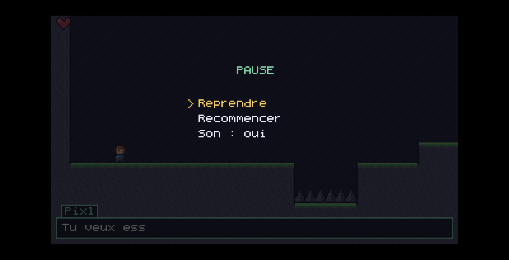

Une fonte, du son, des étincelles, du texte, des menus, une sauvegarde. Aucun
des six ne décide de quoi que ce soit — et c'est exactement pourquoi ils se
dégradent sans qu'on s'en aperçoive : une lettre manquante ne fait tomber aucun
banc, un son qui se rejoue cinquante fois après un rembobinage ne fait rien
planter, un menu qui bute sur sa dernière ligne passe pour un choix.

### Une fonte en pixels, écrite comme les planches

`ctx.fillText` donnerait du texte anticrénelé — du gris sur les bords, dans un
jeu où chaque pixel est une couleur de la palette. Sur un écran agrandi quatre
fois, l'un appartient au jeu et l'autre est posé dessus. Et une police du
système n'est pas la même partout : un dialogue cadré au pixel près chez soi
déborde de sa boîte chez quelqu'un d'autre.

Cinq sur sept, parce que c'est la plus petite taille où les minuscules restent
lisibles avec des jambages. Un glyphe par ligne, sept rangées séparées par une
barre — c'est fait pour le **diff** : quand un pixel bouge, on voit lequel, dans
quelle lettre.

Les accents ne sont pas une option. Une fonte sans « é » fait écrire « eleve »,
et l'on finit par écrire tout le jeu sans accents « parce que la fonte ne les a
pas ».

Un caractère inconnu rend un **pavé plein**, jamais un blanc : un texte où les
caractères manquants disparaissent se lit presque normalement, et l'on livre le
jeu sans avoir vu qu'un mot était amputé. C'est ce qui a fait remarquer que le
curseur des menus — un simple `>` — n'était pas dans la fonte : il s'affichait
en pavé sur la capture d'écran. Un contrôle couvre maintenant tout l'ASCII
imprimable, et il l'aurait dit avant que je regarde.

### Le son, décrit en données

Un projet doit se suffire à lui-même : c'est la règle qui a fait mettre les
planches dans le fichier. Un fichier d'onde pour un bruit de pas pèse trente
kilo-octets, ne se relit pas dans un diff, et rouvre le problème qu'on avait
résolu pour les dessins.

Un son est donc une description — une forme d'onde, une fréquence qui glisse,
une enveloppe, une durée. Six nombres. C'est aussi ce que faisaient les machines
de cette époque : trois oscillateurs et un bruit. La contrainte donne le son du
genre, elle ne le limite pas.

La synthèse est **pure** : elle remplit un tableau d'échantillons et ne connaît
pas le navigateur. Un banc vérifie donc qu'un son dure ce qu'il annonce, que son
enveloppe revient à zéro — un son coupé net à mi-volume claque, et le claquement
s'entend plus que le son —, qu'il ne sature pas, et que les quatre formes d'onde
donnent bien quatre sons différents. Ce qui touche à l'audio du navigateur tient
en dix lignes, à part, et ne contient aucune décision.

**Et un son ne se rejoue pas quand le réseau rembobine.** Les événements
d'animation ressortent à chaque re-simulation : sans mémoire, une correction de
cinquante pas ferait entendre cinquante bruits de pas d'un coup. Le sonneur
retient ce qu'il a joué, par pas *et* par source — deux créatures qui marchent
ensemble doivent s'entendre toutes les deux.

### La musique s'écrit en notes

Même raison, un cran plus haut. Une minute de musique en fichier d'onde pèse dix
mégaoctets et ne se relit pas ; en notes, elle pèse deux kilo-octets et un diff
montre **quelle note a changé**. Une musique est un tempo et des voies ; une voie
est un timbre — un son complet, posé là — et une note par temps. Le point est un
silence, le tiret **prolonge** la note précédente.

Ce tiret n'est pas une commodité d'écriture. Sans lui, une blanche s'écrirait en
répétant la note, et l'on entendrait deux attaques au lieu d'une note tenue :
c'est la différence entre une mélodie et un martèlement. Un banc le mesure en
comptant les creux d'enveloppe — la version tenue en a zéro, la version martelée
en a trois, pour exactement la même durée.

Le timbre est **posé dans la voie** et non désigné par son nom dans le catalogue
des sons. Un renvoi économiserait quelques octets et créerait une référence qui
peut pendre : une musique dont le timbre a été renommé jouerait en silence.

Les voies s'additionnent, et le résultat est **borné**, pas normalisé. Normaliser
ferait dépendre le volume général de la note la plus forte, et deux musiques du
même jeu n'auraient pas le même niveau. Si ça sature, c'est aux volumes de le
dire.

**Et l'export la donne aussi en `.wav`.** Le projet garde les notes ; Godot ne
sait pas synthétiser une onde carrée, il sait lire un fichier. C'est exactement
ce que fait l'export des planches, qui rend des PNG là où le projet garde des
lettres. Le paquet porte les deux, si bien qu'un aller-retour reste possible. Un
contrôle vérifie que chaque son *et* chaque musique a son fichier, que ces
fichiers sont de vrais RIFF/WAVE, et que la musique rendue dure bien ses trois
secondes — un en-tête vide sorti sous le bon nom passerait les deux premiers.

### La traduction : ce qui manque doit se voir

On serait tenté d'indexer par le français : « Reprendre » vers « Continue ».
Beaucoup de jeux le font, et ça casse au premier ajustement — corriger une
virgule orpheline toutes les traductions d'un coup, sans que rien ne le signale.
Une clef ne bouge pas.

Une clef non traduite rend **la clef**, jamais du vide. Une traduction
incomplète est la règle et non l'exception : on ajoute une réplique le lundi et
on traduit le vendredi. Rendre du vide ferait disparaître le texte — un bouton
sans étiquette ne se remarque pas ; `menu.quitter` affiché en plein menu, si.
C'est la même règle que le pavé plein de la fonte pour un caractère inconnu.

Les substitutions sont **nommées** — `{n} vies` — et non positionnelles : l'ordre
des mots change d'une langue à l'autre, un `%s` ne survivrait pas. Il n'y a ni
pluriels ni genres : ils demandent une grammaire par langue, et faire semblant
de les gérer avec une règle simple donne du faux dans la moitié des langues.

Le défaut qui arrive vraiment n'est pas dans le moteur, il est dans le jeu :
quelqu'un ajoute une ligne au menu et écrit son libellé en clair, parce que
c'est plus court. Rien ne tombe — le menu s'affiche, en français, dans toutes
les langues. Un contrôle lit donc la source du menu de pause et refuse toute
chaîne posée en clair dans une entrée.

### L'art de l'artiste entre enfin

L'audit l'a dit sans ménagement : un moteur pixel art **sans import d'image**
est un moteur où l'artiste n'a pas le droit de travailler avec ses outils. Les
gens dessinent dans Aseprite, dans l'éditeur de sprites d'à côté — et exportent
des PNG. La seule façon de mettre un dessin dans un projet était de le retaper
lettre par lettre.

Le bouton **Importer une image…** (onglet *Dessin*) accepte deux choses :

- **une image** (PNG, GIF, WebP…), découpée en cases à la taille qu'on donne —
  elle devient une planche, mêmes lettres et même clé que si on l'avait
  dessinée ici ;
- **un projet de l'éditeur de sprites** (`.pixelforge`) : chaque image de
  l'animation devient une case, calques fondus de bas en haut avec leur
  opacité. C'est le pont entre les deux produits — on dessine et on anime dans
  l'un, on joue dans l'autre.

Trois règles, et elles sont **dites** plutôt que faites en silence, parce que
chacune transforme le dessin de quelqu'un :

- la transparence partielle est aplatie — une planche ne connaît que le plein
  et le vide — et l'import dit combien de pixels y sont passés ;
- un export ×2/×3/×4 est détecté et ramené à l'échelle 1 (l'alpha compte dans
  la détection : un dégradé de transparence n'est pas un gros pixel). Quand la
  taille est *connue* — un `.pixelforge` la déclare — on ne devine pas : la
  détection s'est fait avoir par un dessin sincèrement plat ;
- au-delà de 86 couleurs, l'import **refuse** au lieu de quantifier. Ce n'est
  plus du pixel art, c'est une photo ; quantifier en douce rendrait un dessin
  qui ressemble à l'original sans être celui de l'artiste — la pire des
  politesses.

Le banc fait l'aller-retour qui prouve tout : la planche du héros, rendue en
pixels puis réimportée, revient **au pixel près** — les lettres changent, les
couleurs jamais. Et le banc de fumée passe par la vraie porte : un vrai PNG et
un vrai `.pixelforge` fabriqués dans la page, choisis par le vrai bouton,
décodés par le vrai navigateur.

### Peindre autrement que case par case


Une carte de quarante sur trente-trois, c'est **mille trois cents clics** — et
c'était exactement ce que l'éditeur avait à offrir. Le tracé se choisit
maintenant à côté de l'outil, et il vaut pour l'outil quel qu'il soit :

- **Libre**, case par case, comme avant.
- **Rect** se tire d'un coin à l'autre et ne pose **rien** avant qu'on lâche.
  On pourrait peindre au fur et à mesure puis effacer ce qui déborde ; ce
  serait plus court à écrire et faux à l'usage — un rectangle qu'on retaille
  laisserait derrière lui tout ce qu'il a effleuré, et le « défaire » ne
  rendrait pas la carte de départ. Il compte pour **un** geste : douze cases en
  douze gestes rendraient l'historique inutilisable.
- **Remplir** couvre la zone d'un seul tenant. Quatre voisins et non huit :
  deux zones qui ne se touchent que par un coin sont deux zones, et en diagonale
  le remplissage fuit par le moindre angle dans la pièce d'à côté. Une file et
  non la récursion — quarante mille cases épuisent la pile du navigateur.

Ce n'est pas trois outils de plus. Un rectangle de mur, un rectangle de
collision et un rectangle de tuile sont le même geste sur trois matières ; en
faire des outils séparés donnerait quinze boutons pour trois idées.

Dans les trois cas, **le premier appui décide** : commencer sur une case déjà
peinte *efface* le rectangle ou la zone. C'est la même règle que le pinceau
libre, et le premier essai du banc de fumée l'a prise pour un défaut — le
rectangle avait retiré quinze cases, ce qui était exactement ce qu'on lui
demandait.

### Découper un niveau en tableaux, à la souris

Les salles étaient dans le format et dans le moteur, et **nulle part dans
l'éditeur** : on ne pouvait en créer qu'en modifiant le JSON à la main. L'outil
**Salle** en pose une en tirant un rectangle, et la retire au clic droit. Elle
n'a pas de sens « à main levée » — c'est un rectangle par définition — donc
l'outil l'impose plutôt que de laisser choisir un tracé qui ne voudrait rien
dire. Un simple clic n'en pose pas : une salle d'une case est un clic raté.

Les salles ne passent pas par l'historique du dessin. Les y mêler ferait qu'un
« défaire » sur un coup de pinceau retirerait une salle posée entre-temps, ce
que personne n'attend.

Deux salles qui se recouvrent sont signalées **dans la barre d'état**, et non
par un message passager. Ce n'est pas un événement : c'est un état du niveau,
qui dure tant qu'on ne l'a pas corrigé. Un message qui disparaît au clic suivant
l'annoncerait une fois, à quelqu'un qui regarde ailleurs. Le panneau *Projet*
marque en plus la ligne fautive — la barre dit qu'il y a un problème, le panneau
dit lequel corriger.

Le nom et les quatre nombres se règlent au clavier dans *Projet* : on **tire**
une salle à la souris, ce qui est le bon geste pour dessiner un rectangle et le
mauvais pour le régler à la case près.

### Un chapitre en tableaux, comme Celeste

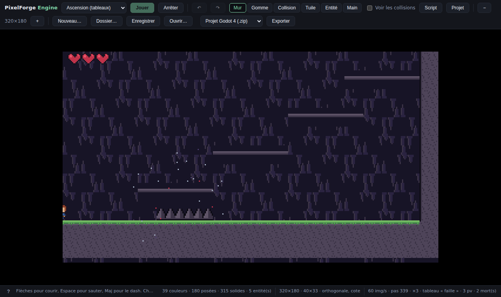

Le moteur savait déjà verrouiller la caméra sur une salle — mais sur une
**grille** : toutes les salles de la même taille, découpées au couteau dans une
carte. C'est le découpage d'Isaac, et il convient à des salles engendrées.

Celeste n'est pas fait comme ça. Ses salles sont des rectangles **posés à la
main**, de tailles différentes : un couloir de deux écrans de large et d'un demi
de haut, un puits d'un demi de large et de trois de haut. La forme de la salle
*est* le niveau. Une grille régulière ne peut pas l'exprimer, et l'on ne peut
donc pas faire un Celeste avec.

Une salle décide de trois choses, et la troisième fait tout le jeu :

1. **Où la caméra s'arrête.** Elle ne sort jamais de la salle courante. Une
   seule règle donne les deux comportements de Celeste : dans une salle de la
   taille de l'écran, les bornes bloquent tout et le tableau est fixe ; dans une
   salle plus large, la caméra suit.
2. **Quand on change de tableau.** Sortir d'une salle fait entrer dans celle
   d'à côté, et l'image glisse — sans arrêter le jeu, parce que s'arrêter
   casserait un enchaînement.
3. **Où l'on réapparaît.** Mourir renvoie à l'entrée du tableau **courant**, pas
   à un point de sauvegarde lointain. C'est ce qui rend la mort assez bon marché
   pour qu'on accepte de mourir deux cents fois dans un chapitre. Un jeu où
   mourir coûte trente secondes de trajet n'est pas un jeu difficile, c'est un
   jeu pénible.

Entre deux salles, on **garde la dernière connue**. Un personnage peut se
trouver dans un interstice — une porte, un pixel entre deux rectangles ;
chercher la salle à chaque pas la rendrait « aucune », la caméra se libérerait
et le tableau sauterait.

Deux salles qui se recouvrent rendent « dans quelle salle suis-je ? » sans
réponse : c'est l'ordre de la liste qui tranche, donc rien. On le **signale** au
lieu de l'interdire — l'éditeur doit pouvoir montrer le problème pendant qu'on
pose une salle, pas refuser de la poser. Une salle qu'aucune autre ne touche est
signalée aussi : c'est du travail perdu, et ça ne se voit qu'en jouant tout le
chapitre.

Le monde **Ascension** met tout cela en jeu : six tableaux en spirale, un point
de vie, une reprise en trois dixièmes de seconde. Un banc le gravit en entier
avec le vrai contrôleur, tableau par tableau, avec une politique volontairement
grossière — tenir une direction, sauter dès qu'on touche le sol. Si un escalier
ne se monte qu'avec un enchaînement précis, il ne se monte pas.

**Deux défauts trouvés en le construisant, et tous deux étaient à l'écran.**
Le héros affichait trois cœurs et mourait au premier coup : le réglage
`pvHeros` et l'espèce avaient divergé, et c'est le réglage qui servait à
l'affichage *et* à la réapparition — si bien que le contrat « une pointe tue »
tenait jusqu'à la première mort, puis se défaisait. Et tomber hors du monde ne
tuait pas : le héros sortait de la carte et chutait indéfiniment, plus rien ne
le touchait, et le jeu avait l'air figé alors qu'il tournait. C'est ce qui
arrive au premier niveau qu'on dessine avec un bord ouvert.

### Une créature qui contourne le mur

« Poursuite » voulait dire : aller vers le héros en ligne droite. Derrière un
mur, la créature poussait contre la pierre indéfiniment. Mesuré sur une salle à
la Isaac — un mur au milieu, un passage à **une case** — elle n'avait pas avancé
d'un seul pixel en quinze secondes. Ce n'est pas une créature qui poursuit mal,
c'est une créature qui ne poursuit pas.

**Un champ de distance, et non un chemin par créature.** Un A\* rend un chemin
par créature : vingt ennemis, vingt recherches, et le coût monte avec le nombre
d'ennemis — exactement là où l'on n'en a pas les moyens, puisque c'est là que le
jeu est chargé. Le champ renverse le problème : on parcourt la salle **une** fois
depuis le héros, chaque case retient sa distance jusqu'à lui, et n'importe quelle
créature n'a plus qu'à regarder ses huit voisines et descendre. Mesuré : 0,095 ms
par pas pour toute la salle, quel que soit le nombre d'ennemis. Une recherche par
créature en coûterait 119 — sept images pour un seul pas.

**Il ne garde rien d'un pas sur l'autre**, et c'est la propriété qui compte pour
le réseau. Un chemin gardé en mémoire est de l'état : après un rembobinage, la
créature repartirait d'un chemin calculé dans un futur qui n'a plus lieu, et les
deux machines divergeraient sans qu'on sache pourquoi. Le champ se recalcule
entièrement depuis le monde du pas courant — il ne peut pas être faux d'un pas à
l'autre parce qu'il n'est jamais reporté.

Les coûts sont des **entiers** : dix pour un pas droit, quatorze pour une
diagonale. On pourrait écrire 1 et 1,41421356 ; ce serait plus juste et moins
sûr. Deux machines qui comparent des flottants dans un tas binaire peuvent les
ordonner autrement dès que deux valeurs se touchent, et le champ différerait
d'une case.

**Le champ ne sert que derrière un mur.** Quand la cible est en vue, on va droit
dessus : suivre un champ de case en case donnerait une marche d'escalier que
l'œil repère aussitôt. Mesuré en salle ouverte : 0,8 px d'écart à la ligne
droite. Et une diagonale ne se faufile jamais entre deux murs qui se touchent par
l'angle — passer là où aucun joueur ne passe se voit tout de suite.

**Seul ce qui se déplace librement se faufile.** Le champ suppose huit
directions. C'est vrai vu de dessus, et vrai d'une créature qui **vole**. Ça ne
l'est pas d'une créature pesante vue de côté : elle marche, et un itinéraire
aérien l'enverrait dans un mur en *s'éloignant* de sa cible — pire que
l'entêtement qu'on corrigeait. C'est le même mot que pour la pesanteur, et ce
n'est pas un hasard : `pesante` dit « ce monde a un bas, et je lui obéis ».

Ce banc a demandé trois essais avant de mesurer quoi que ce soit, et les deux
premiers accusaient le moteur à tort : le bac d'essai tronquait les fractions de
pixel — une créature à 0,67 px par image restait rigoureusement immobile — puis
déplaçait la boîte de collision en laissant le sprite sur place. Les deux donnent
exactement le symptôme qu'on cherchait. Ils sont commentés dans le banc, où ils
sont plus instructifs que la vérification elle-même.

### Les particules ne se photographient pas

Une gerbe d'étincelles ne décide de rien. La mettre dans l'état du jeu
obligerait à la copier dans chaque instantané gardé par le rembobinage, à la
transmettre, à s'accorder dessus entre deux machines — pour quelque chose que
personne ne peut contredire. Après une correction réseau, les étincelles ne sont
pas aux mêmes endroits sur les deux machines, et personne ne s'en apercevra
jamais. C'est précisément le critère.

Un contrôle vérifie que `Particules` n'offre **pas** de `instantane()` : le jour
où quelqu'un en ajoutera un « pour faire comme les autres », il tombera et dira
pourquoi il ne faut pas.

### Le dialogue, et l'appui qui n'attend pas

Le texte s'écrit lettre à lettre — un pavé qui apparaît d'un coup se saute, et
le texte qui se compose donne au joueur une raison d'appuyer, donc une prise. Le
**deuxième** appui affiche la réplique entière : faire attendre quelqu'un qui a
déjà lu est la faute la plus répandue du genre, et elle transforme un dialogue
en corvée.

Le dialogue **arrête le monde**. Laisser courir le jeu derrière une boîte de
texte fait mourir pendant qu'on lit, ce qui est la faute la plus injuste qu'un
jeu puisse commettre. Le banc de fumée le vérifie dans un vrai navigateur :
Échap ouvre la pause, on tient la flèche droite, et le héros ne bouge pas.

### La sauvegarde de la partie n'est pas le projet

Le fichier de projet décrit le **jeu** — cartes, dessins, espèces. La sauvegarde
décrit une **partie** — où en est ce joueur-ci, combien de cœurs, quelles salles
il a vues. Les mélanger a une conséquence immédiate : ouvrir le jeu de quelqu'un
d'autre le fait commencer là où cette personne s'était arrêtée. Et une plus
lente : on ne peut plus corriger un niveau sans invalider les parties en cours.

La graine en fait partie. Un étage engendré n'est reproductible que par elle ;
une sauvegarde qui ne la porte pas rouvre un **autre** étage, avec le héros posé
au milieu d'un mur. C'est le genre de défaut qu'on ne voit qu'après avoir
engendré le deuxième niveau, c'est-à-dire trop tard.

Une sauvegarde d'un autre projet est refusée avec la raison ; une abîmée est
signalée au lieu d'être devinée ; une version plus récente se lit sans faire
semblant de la comprendre.

## Ce qu'un jeu de plateforme doit avoir

**Les pentes.** À quarante-cinq degrés, la hauteur du sol dans une case vaut la
position dans la case : une soustraction, et deux tuiles voisines qui se
raccordent au pixel près. Pour un angle quelconque il faudrait une table par
angle et un arrondi par colonne — c'est le défaut qu'on voit dans la moitié des
jeux amateurs, où le personnage sautille en montant une colline.

Une pente n'est **pas** solide : marquée solide, elle bloque comme un mur et
l'on se cogne dans le bas de la côte au lieu de la monter. Le contrôleur
cherche donc, devant chaque obstacle, si le même pas passe quelques pixels plus
haut : si oui, c'est une pente ou une marche et l'on grimpe ; sinon c'est un mur
et l'on s'arrête. Le même test sert aux deux, ce qui évite d'avoir deux règles
qui se contredisent un jour.

Un détail a coûté cher : debout au sommet exact d'une case de pente, les pieds
sont sur sa frontière haute, donc la rangée du dernier pixel du corps est celle
**au-dessus** de la pente — et la pente devient invisible. On en regarde
maintenant deux.

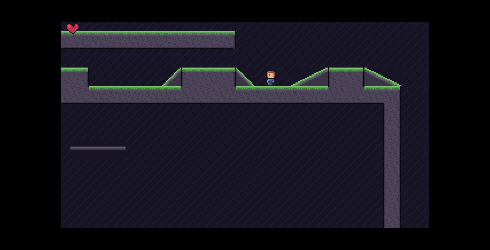

**Les demi-pentes.** Deux cases pour monter d'une : un pixel toutes les deux
colonnes. Ce n'est pas un arrondi — un demi est exact, et deux cases voisines se
raccordent toujours au pixel près. Un tiers, un quart seraient le même calcul
avec un autre diviseur ; on s'arrête à deux parce que trois cases pour monter
d'une case de seize pixels donne une côte qu'on ne distingue plus d'un sol plat,
et parce que chaque raideur de plus est une tuile de plus à dessiner.

Les six formes — deux directions à quarante-cinq degrés, quatre demi-cases —
**s'excluent** : une case n'a qu'une surface. L'éditeur ne les propose donc pas
en cases à cocher, contrairement aux cinq matières. Composer « solide et montant
à droite » aurait été possible, et le fichier en aurait perdu la moitié à
l'enregistrement — la perte qu'on ne remarque qu'en rouvrant le projet.

**Ce que l'écriture d'une case a coûté.** Une case de collision tient en un
caractère : une rangée reste une ligne, et un diff montre la case qui a changé.
C'était de la base trente-six, bornée à trente-cinq « pour que rien ne casse en
silence ». Elle cassait en silence : une pente montant à **gauche** vaut
soixante-quatre, sortait `z`, et se relisait en mur. Toute colline tournée vers
la gauche se rouvrait fausse, et rien ne le disait.

Deux choses avaient rendu ça possible. Le format écrivait les matières
lui-même au lieu d'appeler la fonction qui sait les écrire — deux endroits pour
une valeur, donc un jour où ils divergent. Et la grille tenait dans un tableau
d'**octets**, alors que les matières comptent maintenant neuf drapeaux : « moitié
haute » vaut deux cent cinquante-six et y repassait à zéro.

Les six tuiles de côte ne sont pas dessinées à la main : elles sont **calculées
depuis `hauteurSol`**, la fonction dont se sert le contrôleur. Une rampe dessinée
et une rampe calculée finissent par différer d'un pixel, et l'on ne sait plus
laquelle a tort — le personnage marche au-dessus de la roche, ou s'y enfonce.
Avec une seule source, la question ne peut pas se poser ; un contrôle compare
quand même les deux, colonne par colonne, pour le jour où quelqu'un retouchera
une rampe pour l'embellir.

L'alphabet passe à soixante-deux caractères, la grille à seize bits, et les
valeurs 0 à 31 ne bougent pas — un fichier écrit avant se relit sans une ligne
de migration. Un contrôle parcourt maintenant les quarante-quatre matières que
le format peut porter et vérifie l'aller-retour de chacune, plus qu'aucune ne
s'écrit comme une autre.

**Et les six portages lisent la même chose.** Ils comparaient le caractère à
`'1'`. Un mur hérissé de pointes vaut cinq : il était traversable dans le jeu
porté, et solide nulle part ailleurs. Ils décodent maintenant les drapeaux, et
un banc leur demande, pour chaque matière et **chaque colonne de pixels**, où se
trouve le sol — sept cent quatre réponses, qui doivent toutes tomber juste.

**On ne décolle pas pour une marche d'un pixel.** Une pente ne descend jamais
plus bas que `tuile - 1` : au pied d'une côte il reste un pixel avant la case
plate. Le corps le franchissait en tombant, ce qui le mettait en l'air trois ou
quatre images. Trois images ne se voient pas ; ce qu'elles font, si — elles
déclenchent le coyote, passent l'animation en « chute », coupent les poussières
de course, et rendent possible un saut aérien juste après une côte. Le
personnage descend une colline et l'on croit qu'il sautille. Le contrôleur colle
donc au sol jusqu'à la hauteur qu'il sait monter, et pas un pixel de plus : au
bord d'une falaise, la sonde ne rencontre rien et le corps tombe normalement.
Une vérification garde chacun des deux côtés.

**Le hit-stop.** Un coup qui touche sans que rien ne s'arrête se lit comme un
coup qui *traverse*. Deux ou trois images de gel, et le même coup **porte** :
l'œil a le temps de voir la rencontre. C'est la technique la moins chère et la
plus efficace du genre, et celle qu'aucun moteur généraliste ne propose parce
qu'elle contredit l'idée d'une simulation régulière.

Elle **gèle** la simulation, elle ne la ralentit pas : un ralentissement étale
le mouvement, un arrêt le suspend, et c'est l'interruption nette qui fait
l'impact. L'affichage, lui, continue — sinon on ne verrait pas les étincelles
jaillir pendant l'arrêt. Deux coups au même instant n'additionnent pas leurs
arrêts : le plus long l'emporte, sans quoi une mêlée fige le jeu une
demi-seconde.

**La secousse de caméra** est entière et reproductible. Un tremblement en
sous-pixel fait onduler toute la grille — le défaut exact que l'échelle entière
existe pour éviter, réintroduit par la porte de derrière. Elle décroît
linéairement : une décroissance exponentielle laisse un demi-pixel de
tremblement une seconde après le coup, et l'on ne comprend pas pourquoi l'image
ne se pose pas.

**La manette, le tactile, les touches.** La couche d'*actions* existait depuis
le premier jour — le jeu demande « est-ce que le joueur veut aller à droite » et
non « la flèche droite est-elle enfoncée » — et personne n'était jamais venu y
brancher autre chose qu'un clavier. Une manette s'*interroge* au pas et non à
l'image, sinon son état ne correspondrait plus à celui du clavier au même pas et
un rejeu ne reproduirait plus rien. Les zones tactiles sont en **fractions** de
la surface, pour que la même description marche sur un téléphone et sur une
tablette. Et le plan de touches est dans le fichier de projet : un plan figé rend
le jeu injouable pour une partie des gens, en silence.

## Dessiner, monter et régler dans l'éditeur

On pouvait créer une espèce sans écrire une ligne de TypeScript — et elle
empruntait forcément le dessin d'une autre. Trois ateliers referment ça.

**Le dessin** est le seul geste de l'éditeur qui ne passe **pas** par la
reconstruction du projet. Tous les autres transforment le fichier et relisent le
monde ; celui-ci ne peut pas, parce qu'on peint soixante pixels par seconde en
glissant la souris. On modifie donc la planche vivante et l'on refait l'atlas —
cent fois moins cher, et sans risque : une planche ne porte aucune référence
vers autre chose.

On peint une **lettre** et non une couleur. Un dessin est une grille de lettres,
et la clé dit quelle couleur chaque lettre porte ; peindre une couleur
directement obligerait à inventer une lettre par teinte. Le sous-produit est
qu'un dessin ne peut pas sortir de la palette.

**Le monteur d'animations** montre les **événements** — « le pied touche ici »,
« le coup porte là ». C'est ce qui le distingue d'un diaporama, et la seule
façon d'accorder un son à un dessin. Les cacher ferait régler les sons en
millisecondes, ce que tout le moteur existe pour éviter. Retirer une image
décale les événements suivants : ne pas les décaler ferait sonner le pas à la
mauvaise image, sans que rien ne le signale.

**Le réglage des sons** a un bouton *Écouter*, et ce n'est pas un agrément : un
son ne se règle pas par le raisonnement. On change une fréquence de cinquante
hertz, on écoute, on recommence. Sans ce bouton il faudrait relancer le jeu et
provoquer l'événement pour entendre chaque essai — le réglage deviendrait si
pénible que personne ne toucherait aux sons livrés.

## Ce qu'on affirmait sans l'avoir mesuré

« Soixante images par seconde » figurait dans ce README depuis le premier jour
et reposait sur ma parole. `npm run banc:charge` le mesure :

    300 créatures · 0,394 ms par pas · 42 pas de simulation par image
    4000 particules · 0,184 ms
    rembobinage de 16 pas · 1,05 ms
    un étage engendré · 2,47 ms

On mesure le **pas de simulation** et non l'image : le dessin dépend du
navigateur et de la machine, la simulation ne dépend que du code. Et l'on
mesure la **pente** du coût, pas seulement sa valeur : douze fois plus de
créatures pour cinq fois le temps. Un coût linéaire tient encore à mille ; un
coût quadratique s'écroule dès deux cents, et aurait donné cent quarante-quatre.

Les seuils sont larges à dessein. Une machine de compilation partagée n'est pas
une machine de joueur, et un seuil serré rendrait ce banc rouge une fois sur cinq
pour des raisons étrangères au code — un banc qui échoue au hasard cesse d'être
lu. Ils repèrent un décrochage franc, et le chiffre s'affiche toujours pour
qu'une dérive se voie même quand le banc passe.

## L'agent qui évalue, et qui reboucle

    npm run agent            # tout, navigateur compris
    npm run agent -- --rapide    # sans le navigateur
    npm run agent -- --ecrire    # met à jour docs/evaluation.{json,md}

Une note monte toute seule d'une itération à l'autre : on ajoute du code, on se
sent avancé, on écrit 7/10 là où l'on écrivait 6. Elle ne se contredit jamais,
donc elle n'apprend rien. Ce que l'agent produit n'est pas une note : c'est un
**état**, et la différence avec l'état précédent.

**Il ne juge pas, il cherche des preuves.** Un critère n'est pas tenu parce que
le code a l'air de le faire. Il est tenu quand il existe des vérifications qui
deviendraient rouges si la chose disparaissait, et que les symboles nommés
existent dans les sources. Chaque ligne du rapport est donc falsifiable : on
peut aller lire les preuves, et l'on peut les casser exprès pour voir le critère
tomber. C'est ce qu'on a fait — supprimer une vérification du banc fait sortir
l'agent en erreur, la remettre le fait taire.

C'est aussi ce qui rend le rebouclage utile. **Une preuve qui disparaît est une
régression que rien d'autre ne détecte** : les bancs restent verts, le build
passe, et l'on a simplement cessé de vérifier quelque chose. L'agent échoue
dans ce cas-là, exactement comme pour un banc rouge.

### Ce que le premier rebouclage a trouvé — dans l'agent lui-même

Le premier passage a nommé cinq critères où le code existait mais la preuve
manquait. On les a écrits — de vraies vérifications, jamais un élargissement
des indices : régler la mesure sur le résultat voulu la rend inutile.

Le deuxième passage a trouvé trois défauts, tous dans l'agent :

- **Il se lisait lui-même.** Un critère nommant le symbole `jouerSon` se
  déclarait tenu parce que le mot figurait… dans la ligne du critère. La mesure
  se satisfaisait de son propre énoncé, ce qui est la plus complète des
  illusions : elle passe au vert pour tout ce qu'on lui demande de chercher, et
  d'autant mieux qu'on lui en demande davantage.
- **Il comparait au mot près, non.** L'indice « son » se retrouvait dans
  « raison » et « moisson », « mur » dans « murale », « coup » dans
  « coupure » : trente et une preuves apparaissaient pour un critère qui n'en
  avait aucune. Une mesure trop indulgente est pire qu'une mesure absente, parce
  qu'elle rassure.
- **Il criait au loup.** Un passage sans navigateur, comparé à un passage
  complet, annonçait cinquante-cinq vérifications disparues. Un agent qui se
  trompe une fois sur deux cesse d'être lu — et c'est alors qu'il manque la
  vraie régression. Il refuse maintenant de comparer ce qui n'a pas tourné des
  deux côtés, et refuse d'enregistrer un relevé partiel.

Et une quatrième dans la langue : la normalisation Unicode sépare l'accent de
sa lettre mais ne touche pas à « œ ». L'agent déclarait donc manquante une
preuve nommée « un cœur posé par une salle dessinée » — accuser à tort est le
pire défaut d'une mesure.

### Où en est le projet, d'après lui

    Celeste — plateforme de précision             14/14
    The Binding of Isaac — salles engendrées       7/7
    Dead Cells — combat et corps                   6/6
    Faire un jeu sans lire le moteur              10/10
    Le multijoueur, et ce qu'il exige d'abord      6/6
    Ce qu'on affirme sans l'avoir mesuré           4/4
    Ce qu'un jeu de plateforme doit avoir          9/9
    Ce qu'un jeu a en plus de son gameplay        13/13
    Le déployer sans que ça casse en production    4/4
                                          829 vérifications

Les cinq critères ajoutés au dernier tour — musique, export `.wav`, traduction,
libellés jamais en clair, accord des six portages sur les notes et les textes —
sont partis rouges. L'un d'eux l'est resté après coup : le `.wav` était écrit,
branché sur les deux paquets, et **rien ne vérifiait que l'archive le
contenait**. Trois vérifications de plus, et le trou s'est fermé.

La grille a ensuite gagné une rubrique qu'elle n'avait pas : **le déployer**.
Elle n'a rien mesuré du tout au premier essai — l'agent ne lisait que `src/` et
`scripts/`, si bien qu'il déclarait « le code n'existe pas » pour du code écrit
dans le Dockerfile. Un moteur qu'on ne peut pas mettre en ligne n'est pas fini ;
ce qui le met en ligne se mesure comme le reste.

Le tour suivant a demandé les demi-pentes. Elles ont coûté trois défauts qui
dormaient depuis longtemps et qu'aucun banc ne regardait : une pente montant à
gauche que l'enregistrement transformait en mur, neuf drapeaux dans un tableau
d'octets, et six chargeurs qui comparaient une matière au caractère `'1'`. Aucun
des trois n'aurait été trouvé en écrivant les demi-pentes ; ils l'ont été en
écrivant les vérifications qui vont avec.

Elle est de nouveau entièrement verte, donc elle ne mesure plus rien. C'est le
moment de l'élargir, pas de s'en féliciter.

Le relevé complet est dans [`docs/evaluation.md`](docs/evaluation.md).

## La méthode

Chaque règle est éprouvée dans les **deux sens** : sur un cas où elle doit se
taire, et sur un cas fabriqué où elle doit parler. Un banc qui ne sait pas
échouer ne protège rien.

Un banc de plus, `npm run fumee`, ouvre l'éditeur dans un vrai navigateur :
il charge les quatre mondes, joue dans chacun, peint une case, ouvre l'atelier,
exporte, et refuse de passer si la console a dit quoi que ce soit. Les autres
bancs éprouvent du calcul et ont raison de tourner en Node pur ; celui-ci
attrape ce qui ne se voit qu'à l'écran. Il a trouvé sa première faute le jour où
il a été écrit — une règle de style écrasait l'attribut `hidden`, et le panneau
de scripts ne se fermait jamais.

Le banc a déjà pris ce dépôt en défaut plusieurs fois — un double de test qui
n'appliquait pas le plafond de la vraie boucle et rendait 500 pas au lieu de 5 ;
47 tuiles de mur qui pointaient toutes sur le même dessin, si bien que les murs
ne se rejoignaient jamais à l'écran ; `caseVersMonde` qui rendait le sommet du
losange quand son inverse attendait le coin de la boîte, et faisait rater les
144 cases sur 144 d'un aller-retour isométrique.

Ce que le banc des mondes vérifie, et qu'aucun typage ne peut poser comme
question :

- les dalles isométriques **pavent** le plan — on les rastérise et l'on compte
  les pixels de fond visibles entre elles ; une dalle plus étroite d'un pixel
  par rangée est présentée en contre-exemple et doit échouer ;
- aucune case visible n'est **écartée** du parcours de rendu, à cinq positions
  de caméra et dans les quatre projections ;
- les niveaux sont **franchissables** : pas « ont l'air », mais le vrai
  contrôleur, sur la vraie carte, arrive de l'autre côté de chaque fosse et
  remonte le puits ; et sans saut mural, il n'y arrive pas.

Le dépôt est **entièrement en texte**, dessins compris : une lettre par couleur,
le point pour le vide. Un diff dit ce qui a bougé dans un sprite.

## Parenté

Petit frère de [PixelForge](https://github.com/jules-crevoisier/sprite),
l'éditeur de sprites. Les deux partagent leurs leçons : l'arrondi qui commute
avec le miroir vient de là, et il y avait coûté 40 % d'asymétrie sur une lame
pourtant parfaitement symétrique.
